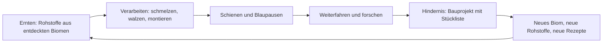
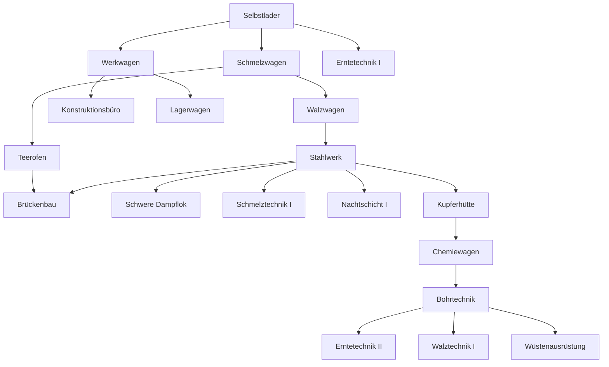

# Linie Null

**Spielkonzept, Version 1** · Schritt 2 von 3 (Brainstorming, Konzept, Prototyp) · Stand 13. September 2026

| | |
|---|---|
| Arbeitstitel | Linie Null |
| Genre | Idle-Aufbauspiel mit Produktionsketten, in der Tradition von Idle Planet Miner und Dyson Sphere Program |
| Plattform | Progressive Web App. Handy im Hochformat zuerst, Desktop-Browser ebenfalls |
| Sprache | Deutsch (Schweiz) |
| Status | Konzept beschlossen, Prototyp noch nicht begonnen |

## Inhalt

1. [Pitch](#1-pitch)
2. [Herleitung und Entscheidungen](#2-herleitung-und-entscheidungen)
3. [Design-Säulen](#3-design-säulen)
4. [Kern-Loop](#4-kern-loop)
5. [Die Welt](#5-die-welt)
6. [Der Zug](#6-der-zug)
7. [Produktion](#7-produktion)
8. [Forschung](#8-forschung)
9. [Bauprojekte](#9-bauprojekte)
10. [Offline und Rückkehr](#10-offline-und-rückkehr)
11. [Spielverlauf](#11-spielverlauf)
12. [Oberfläche](#12-oberfläche)
13. [Grafik und Ton](#13-grafik-und-ton)
14. [Technik](#14-technik)
15. [Erster spielbarer Stand](#15-erster-spielbarer-stand)
16. [Später](#16-später)
17. [Risiken und offene Fragen](#17-risiken-und-offene-fragen)
18. [Glossar](#18-glossar)

## 1. Pitch

Du bist Ingenieurin oder Ingenieur der Linie Null, der ersten Bahnlinie in eine Welt, die noch niemand durchquert hat. Dein Zug ist deine Fabrik: Jeder Wagen ist eine Maschine, Schienen sind ein Produkt, und ohne Schienen steht der Zug. Vor dir liegen Biome mit neuen Rohstoffen und Hindernisse, die nur ein Bauprojekt überwindet: eine Brücke, ein Tunnel, eine Fähre, am Ende ein Raumbahnhof.

Am Anfang schaufelst du Kohle von Hand. Am Ende plant ein Fahrplan den Zug, und du kommst nach Stunden zurück, um zu sehen, wie weit er gekommen ist.

## 2. Herleitung und Entscheidungen

Im Brainstorming standen fünf Richtungen zur Wahl: der Zug, ein Turm, ein Generationenschiff, Terraforming und ein Uhrwerk-Automat. Der Zug hat gewonnen, weil er alle sechs Säulen trägt, weil Weiterfahren die natürlichste Offline-Metapher ist, und weil eine Linie von Wagen eine Fabrik ist, die eine Person bauen und balancieren kann. Der Turm bleibt als Plan B mit derselben Engine dokumentiert (siehe Abschnitt 16).

Folgende Entscheidungen sind gefallen und gelten für alle weiteren Schritte:

| Nr. | Frage | Entscheidung |
|---|---|---|
| 1 | Thema | Der Zug |
| 2 | Lager | Ein gemeinsames Zuglager. Die Reihenfolge der Wagen zählt nur für Nachbarschaftsboni. Wagen mit eigenen Puffern sind eine spätere Erweiterung |
| 3 | Geld | Kein Geld. Kilometer und Blaupausen sind die Währungen. Frachtaufträge kommen später als Bonusquelle |
| 4 | Zahlenstil | Fabrik-Raten in Stück pro Minute, überschaubar und lesbar. Keine Exponentialzahlen |
| 5 | Handarbeit | Die ersten Minuten arbeitet man von Hand. Danach ist Tippen nie mehr Pflicht, nur noch Beschleunigung |
| 6 | Grafik | Flache Silhouetten als SVG, kräftige Biomfarben, ruhige Animationen |
| 7 | Prestige | «Neue Linie» ist eingeplant, wird aber erst nach dem ersten kompletten Durchlauf gestaltet |
| 8 | Name | Linie Null als Arbeitstitel |

## 3. Design-Säulen

Jede Funktion muss mindestens eine Säule stützen. Was keine stützt, fliegt raus.

| Säule | Was das im Spiel heisst |
|---|---|
| Ketten | Produkte bauen Produkte. Jede Stufe hat Rezepte mit mehreren Vorstufen. Eine Kette muss man erst durchschauen und dann beherrschen |
| Aufstieg | Bessere Wagen, bessere Loks, höhere Stufen. Der Ertrag wird reinvestiert: in Tempo (mehr Wagen, höhere Stufe) oder in Effizienz (Technologien) |
| Vom Handwerk zur Automation | Handkurbel und Werkbank am Anfang. Dann Wagen, die von selbst laufen. Dann Kräne, Aussenposten, Fahrplan |
| Meilensteine | Bauprojekte mit Stückliste. Die Brücke ist die erste blaue Matrix: Sie verlangt eine laufende Stahlkette. Wenn sie steht, ändert sich die Welt sichtbar |
| Es läuft weiter | Der Zug fährt und produziert, während die App geschlossen ist, bis zu einem Deckel. Die Rückkehr bekommt einen Bericht |
| Etwas wächst sichtbar | Der Zug wird länger und moderner. Brücken und Tunnel bleiben in der Landschaft stehen. Man sieht den Fortschritt, ohne eine Zahl zu lesen |

## 4. Kern-Loop



Zwei Produkte treiben alles an:

- **Schienen** bringen Kilometer. Ein Kilometer Strecke verbraucht 100 Schienen.
- **Blaupausen** bringen Forschung. Jede Stufe hat ihre eigene Blaupause, gebaut aus zwei Produkten dieser Stufe.

Alles andere existiert, um diese beiden effizienter zu machen. Es gibt kein Geld. Fortschritt misst sich an vier Dingen: Kilometer, erforschte Technologien, fertige Bauprojekte, und der Lok, die den Zug zieht.

Der Loop hat drei Zeitskalen:

| Skala | Dauer | Was passiert |
|---|---|---|
| Minuten | 1 bis 10 min | Rezept wechseln, Wagen anhängen, Wagen aufstufen, Forschung starten |
| Stunden | 1 bis 3 h | Ein Biom durchqueren, ein Bauprojekt füllen, eine Lok bauen |
| Tage | 1 bis 3 Tage | Eine Stufe abschliessen, den ersten spielbaren Stand durchspielen |

## 5. Die Welt

### 5.1 Fiktion

Die Welt ist ein Kontinent, den niemand durchquert hat. Die Gesellschaft Linie Null baut die erste Bahn hinein, und zwar so, wie es die Gründer für richtig halten: Die Fabrik fährt mit. Was hinter dem Zug liegt, bleibt als Linie offen. Nachschubzüge bringen, was dort abgebaut wird, nur langsamer als vor Ort. Der Ton ist warm und trocken, kein Pathos. Texte sind kurz, Ereignisse werden wie Einträge im Fahrtenbuch formuliert: «Km 8. Der Wald beginnt. Harz gefunden.»

### 5.2 Die Strecke

Die Strecke ist der Techbaum, den man sehen kann. Jedes Biom liefert neue Rohstoffe, jedes Hindernis verlangt eine Stufe mehr Automation.

| Ab km | Biom oder Hindernis | Neue Rohstoffe | Bauprojekt | Im ersten Stand |
|---|---|---|---|---|
| 0 | Tal | Eisenerz, Kohle, Holz, Stein | | ja |
| 8 | Wald | Holz (reich), Harz | | ja |
| 24 | Schlucht | | Brücke | ja |
| 24 | Berg | Kupfererz, Kalk, Salpeter | | ja |
| 36 | Bergmassiv | | Tunnel | ja |
| 48 | Wüste | Sand, Öl, Salz | Wüstenstrecke | nein, Ausblick |
| 72 | Küste | Wasser, Muschelkalk | Fähre | nein |
| 96 | Vulkan | Schwefel, Titan, Erdwärme | | nein |
| 120 | Hochgebirge | Quarz, Silber, Eis | Zahnradbahn | nein |
| 150 | Weltende | | Raumbahnhof | nein |

Die Kilometer nach der Wüste sind Platzhalter und werden beim Ausbau neu balanciert.

### 5.3 Rohstoffe und Ernte

- Ein Erntewagen erntet genau einen Rohstoff, wählbar, jederzeit umschaltbar.
- Jeder Rohstoff ist ab dem Moment verfügbar, in dem sein Biom entdeckt wurde, und bleibt es. Das verhindert Sackgassen: Wer im Berg Teer braucht, kann weiterhin Harz ernten.
- **Vor-Ort-Bonus:** Steht der Zug im Heimat-Biom eines Rohstoffs, erntet ein Erntewagen ihn mit Faktor 1,5. Sonst mit Faktor 1.
- Ernteraten auf Stufe 1, ohne Boni:

| Rohstoff | Heimat | Stück pro Minute |
|---|---|---|
| Eisenerz | Tal | 30 |
| Kohle | Tal | 30 |
| Holz | Tal, im Wald reich | 30 |
| Stein | Tal | 30 |
| Harz | Wald | 20 |
| Kupfererz | Berg | 24 |
| Kalk | Berg | 30 |
| Salpeter | Berg | 20 |

Holz gilt als Rohstoff des Tals, der Wald ist sein reiches Vorkommen: Dort gilt der Vor-Ort-Bonus für Holz ebenfalls.

## 6. Der Zug

### 6.1 Die Lok

Die Lok bestimmt drei Dinge: wie viele Wagen sie zieht, wie schnell der Zug höchstens fährt, und womit sie fährt. Jede neue Lok ist ein Bauprojekt (Abschnitt 9) und der sichtbarste Fortschritt im Spiel.

| Lok | Wagen | Höchsttempo | Brennstoff | Verbrauch je km | Im ersten Stand |
|---|---|---|---|---|---|
| Dampflok | 8 | 12 km/h | Kohle | 30 | ja, Start |
| Schwere Dampflok | 12 | 15 km/h | Koks | 25 | ja |
| Diesellok | 18 | 20 km/h | Diesel | 15 | nein |
| E-Lok | 28 | 30 km/h | Strom aus Generatorwagen | | nein |
| Maglev | 40 | 60 km/h | Strom, Supraleiter | | nein |

Brennstoff wird nur beim Fahren verbraucht und automatisch aus dem Lager genommen. Ein stehender Zug kostet nichts.

### 6.2 Bewegung

- Ein Kilometer Strecke verbraucht 100 Schienen.
- Der Zug fährt, solange Schienen und Brennstoff im Lager sind, höchstens mit dem Tempo der Lok. Bei 12 km/h sind das 20 Schienen und 6 Kohle pro Minute.
- Der Zug hält vor einem Hindernis, bis das Bauprojekt fertig ist. Er hält auch ohne Schienen oder ohne Brennstoff. Wagen produzieren im Stand weiter.
- Beim Erreichen eines Bioms erscheint ein Fahrtenbuch-Eintrag, die neuen Rohstoffe werden freigeschaltet, und die Landschaft wechselt.

### 6.3 Die Wagen

Ein Wagen belegt einen Platz hinter der Lok. Jeder Wagentyp hat eine Aufgabe, ein aktives Rezept und eine Stufe.

| Wagentyp | Aufgabe | Baukosten | Freischaltung |
|---|---|---|---|
| Erntewagen | Erntet einen Rohstoff | 1 Fahrgestell, 6 Zahnrad, 10 Bretter | Start |
| Schmelzwagen | Koks, Barren, Teer, Stahl | 1 Fahrgestell, 20 Stein, 8 Eisenbarren | Technologie Schmelzwagen |
| Walzwagen | Schienen, Träger, Draht | 1 Fahrgestell, 12 Eisenbarren, 6 Zahnrad | Technologie Walzwagen |
| Werkwagen | Bretter, Zahnräder, Nieten, Bauteile | 1 Fahrgestell, 8 Eisenbarren, 12 Bretter | Technologie Werkwagen |
| Konstruktionsbüro | Blaupausen | 1 Fahrgestell, 20 Bretter, 4 Zahnrad | Technologie Konstruktionsbüro |
| Lagerwagen | Erhöht jede Lagerkapazität um 200 | 1 Fahrgestell, 16 Bretter, 8 Nieten | Technologie Lagerwagen |
| Chemiewagen | Sprengstoff, Mörtel | 1 Fahrgestell, 10 Stahl, 8 Kupferdraht | Technologie Chemiewagen |

Regeln:

- **Stufen.** Jeder Wagen hat Stufe 1 bis 5. Jede Stufe bringt 20 Prozent mehr Tempo, Stufe 5 also Faktor 1,8. Das Aufstufen auf Stufe n kostet n-mal die Baukosten ohne Fahrgestell. Ein Erntewagen auf Stufe 2 kostet also 12 Zahnrad und 20 Bretter.
- **Rezeptwechsel** ist jederzeit möglich und kostenlos. Der laufende Fortschritt geht verloren.
- **Abkoppeln** gibt die Hälfte der Baukosten zurück.
- **Umkoppeln** (Reihenfolge ändern) ist per Ziehen möglich.
- **Nachbarschaftsbonus.** Verbraucht ein Wagen ein Produkt, das der Wagen direkt vor ihm (Richtung Lok) herstellt oder erntet, arbeitet er 10 Prozent schneller. Das ist die einzige Regel, die von der Reihenfolge abhängt. Sie belohnt eine sinnvoll sortierte Kette, ohne etwas zu blockieren.
- **Status.** Ein Wagen ist entweder aktiv, wartet auf Eingabe (Zutat fehlt), oder blockiert (Lager für sein Produkt voll). Der Status ist in der Liste sofort erkennbar.

### 6.4 Die Werkstatt

Direkt hinter der Lok hängt die Werkstatt. Sie belegt keinen Wagenplatz und kann nicht abgekoppelt werden. Sie ist das Werkzeug der Handarbeit:

- **Werkbank.** Jedes freigeschaltete Rezept kann hier von Hand gebaut werden, ohne den passenden Wagen. Aufträge werden in eine Warteschlange von höchstens 10 gestellt und mit einfachem Tempo abgearbeitet. Damit baut man den ersten Werkwagen, bevor es einen Werkwagen gibt.
- **Handkurbel.** Vor der Technologie Selbstlader erntet ein Erntewagen nur, wenn man kurbelt: Jeder Tipp gibt 5 Sekunden Ernte. Danach läuft er von selbst, und der Tipp bleibt als kleiner Bonus.
- **Kohle schaufeln.** Ein Tipp auf den Tender gibt 1 Kohle. Das ist der allererste Handgriff im Spiel.

Nach den ersten Minuten ist nichts davon Pflicht. Die Werkbank bleibt nützlich, um einen Engpass kurz zu überbrücken.

### 6.5 Das Lager

- Der Zug hat ein gemeinsames Lager. Alle Wagen nehmen daraus und legen dort ab.
- Jede Ware hat eine Kapazität von 200 Stück, plus 200 pro Lagerwagen. Blaupausen zählen wie Waren.
- Ist die Kapazität einer Ware erreicht, blockiert der Wagen, der sie herstellt. Das ist der Grund, zurückzukommen, und der Grund für Lagerwagen.
- Baustellen (Abschnitt 9) ziehen Material aus dem Lager, sobald es da ist. Die Kapazität begrenzt also nie ein Bauprojekt.

## 7. Produktion

### 7.1 Stufen und Blaupausen

| Stufe | Blaupause | Rezept der Blaupause | Typische Produkte | Wo sie beginnt |
|---|---|---|---|---|
| 1 Eisenzeit | Eiserne Blaupause | 1 Zahnrad, 2 Bretter, 10 s | Eisenbarren, Koks, Bretter, Zahnrad, Nieten, Schienen, Fahrgestell | Tal |
| 2 Stahlzeit | Stahl-Blaupause | 1 Dampfkessel, 2 Teer, 20 s | Stahl, Stahlträger, Dampfkessel, Teer, Bohlen | Tal und Wald |
| 3 Kupferzeit | Kupfer-Blaupause | 1 Kupferspule, 1 Sprengstoff, 30 s | Kupferbarren, Kupferdraht, Kupferspule, Bohrkopf, Sprengstoff, Mörtel, Stützbalken | Berg |
| 4 Chemie | Chemie-Blaupause | später | Glas, Diesel, Plastik, Säure, Gummi | Wüste |
| 5 Elektrik | Elektro-Blaupause | später | Generator, Motor, Kabel, Batterie, Oberleitung | Vulkan |
| 6 Hochtechnologie | Titan-Blaupause | später | Chip, Titanlegierung, Supraleiter, Raketenteil | Hochgebirge |

Stufen 1 bis 3 sind im ersten spielbaren Stand.

### 7.2 Rezepte des ersten Stands

Dauer gilt für Stufe 1 ohne Boni. Rate ist die Ausgabe pro Minute.

**Schmelzwagen**

| Rezept | Eingabe | Ausgabe | Dauer | Rate | Freischaltung |
|---|---|---|---|---|---|
| Koks | 1 Kohle | 1 Koks | 2 s | 30 | Start |
| Eisenbarren | 2 Eisenerz, 1 Koks | 1 Eisenbarren | 4 s | 15 | Start |
| Teer | 2 Harz | 1 Teer | 3 s | 20 | Teerofen |
| Stahl | 2 Eisenbarren, 1 Koks | 1 Stahl | 6 s | 10 | Stahlwerk |
| Kupferbarren | 2 Kupfererz, 1 Koks | 1 Kupferbarren | 4 s | 15 | Kupferhütte |

**Walzwagen**

| Rezept | Eingabe | Ausgabe | Dauer | Rate | Freischaltung |
|---|---|---|---|---|---|
| Schienen | 1 Eisenbarren | 2 Schienen | 6 s | 20 | Start |
| Stahlträger | 2 Stahl, 2 Nieten | 1 Stahlträger | 8 s | 7,5 | Stahlwerk |
| Kupferdraht | 1 Kupferbarren | 3 Kupferdraht | 4 s | 45 | Kupferhütte |

**Werkwagen**

| Rezept | Eingabe | Ausgabe | Dauer | Rate | Freischaltung |
|---|---|---|---|---|---|
| Bretter | 1 Holz | 2 Bretter | 2 s | 60 | Start |
| Zahnrad | 1 Eisenbarren | 1 Zahnrad | 3 s | 20 | Start |
| Nieten | 1 Eisenbarren | 4 Nieten | 3 s | 80 | Start |
| Fahrgestell | 4 Eisenbarren, 2 Zahnrad, 4 Bretter | 1 Fahrgestell | 12 s | 5 | Start |
| Bohlen | 2 Bretter, 1 Teer | 2 Bohlen | 4 s | 30 | Teerofen |
| Dampfkessel | 3 Stahl, 6 Nieten | 1 Dampfkessel | 10 s | 6 | Stahlwerk |
| Kupferspule | 4 Kupferdraht, 1 Zahnrad | 1 Kupferspule | 6 s | 10 | Kupferhütte |
| Bohrkopf | 2 Stahl, 1 Kupferspule | 1 Bohrkopf | 8 s | 7,5 | Bohrtechnik |
| Stützbalken | 2 Bohlen, 2 Nieten | 1 Stützbalken | 4 s | 15 | Bohrtechnik |

**Chemiewagen**

| Rezept | Eingabe | Ausgabe | Dauer | Rate | Freischaltung |
|---|---|---|---|---|---|
| Sprengstoff | 2 Salpeter, 1 Koks | 1 Sprengstoff | 5 s | 12 | Chemiewagen |
| Mörtel | 2 Kalk, 1 Stein | 2 Mörtel | 4 s | 30 | Chemiewagen |

**Konstruktionsbüro**

| Rezept | Eingabe | Ausgabe | Dauer | Rate | Freischaltung |
|---|---|---|---|---|---|
| Eiserne Blaupause | 1 Zahnrad, 2 Bretter | 1 | 10 s | 6 | Start |
| Stahl-Blaupause | 1 Dampfkessel, 2 Teer | 1 | 20 s | 3 | Stahlwerk und Teerofen |
| Kupfer-Blaupause | 1 Kupferspule, 1 Sprengstoff | 1 | 30 s | 2 | Chemiewagen |

Zusammen: 8 Rohstoffe, 19 hergestellte Waren, 3 Blaupausen, 22 Rezepte.

### 7.3 Kettenrechnung

Beispiel: Ein Zug, der die Dampflok mit 20 Schienen pro Minute am Limit fährt.

| Wagen | Rezept | Braucht pro Minute | Liefert pro Minute |
|---|---|---|---|
| Erntewagen | Eisenerz | | 30 Eisenerz |
| Erntewagen | Kohle | | 30 Kohle |
| Schmelzwagen | Koks | 30 Kohle | 30 Koks |
| Schmelzwagen | Eisenbarren | 30 Eisenerz, 15 Koks | 15 Eisenbarren |
| Walzwagen | Schienen | 10 Eisenbarren | 20 Schienen |
| Werkwagen | Zahnrad, Bretter im Wechsel | 5 Eisenbarren, Holz | Zahnräder, Bretter |
| Konstruktionsbüro | Eiserne Blaupause | Zahnrad, Bretter | bis 6 Blaupausen |

Das sind 7 Wagen von 8. Die Kohle ist knapp: Der Koks-Wagen nimmt, was da ist, bis sein Lager voll ist, erst dann bleibt Kohle für den Kessel. Der achte Platz ist die erste echte Entscheidung: ein zweiter Kohle-Erntewagen, Holz-Ernte, oder ein Lagerwagen. Genau so soll sich der Anfang anfühlen: Alles läuft, aber alles ist knapp.

Alle Zahlen in diesem Konzept sind Startwerte. Sie liegen im Code in einer einzigen Datei (`balance.ts`) und werden im Spieltest angepasst.

## 8. Forschung

Forschung kostet Blaupausen und Zeit. Die Blaupausen werden beim Start bezahlt, dann läuft die Forschung im Konstruktionsbüro. Ohne Büro forscht die Werkstatt, mit halbem Tempo. Es läuft immer nur eine Forschung, eine Warteschlange kommt später.

| Technologie | Kosten | Dauer | Voraussetzung | Wirkung |
|---|---|---|---|---|
| Selbstlader | 3 Eiserne | 30 s | | Erntewagen arbeiten ohne Handkurbel |
| Schmelzwagen | 4 Eiserne | 45 s | Selbstlader | Schmelzwagen baubar |
| Werkwagen | 4 Eiserne | 45 s | Selbstlader | Werkwagen baubar |
| Walzwagen | 6 Eiserne | 60 s | Schmelzwagen | Walzwagen baubar, Schienen automatisch |
| Konstruktionsbüro | 8 Eiserne | 60 s | Werkwagen | Konstruktionsbüro baubar |
| Lagerwagen | 8 Eiserne | 60 s | Werkwagen | Lagerwagen baubar |
| Erntetechnik I | 12 Eiserne | 90 s | Selbstlader | Ernte plus 25 Prozent |
| Stahlwerk | 20 Eiserne | 120 s | Walzwagen | Stahl, Stahlträger, Dampfkessel |
| Teerofen | 15 Eiserne | 90 s | Schmelzwagen, Wald entdeckt | Teer, Bohlen |
| Brückenbau | 10 Stahl | 120 s | Stahlwerk, Teerofen | Bauprojekt Brücke |
| Schwere Dampflok | 15 Stahl | 180 s | Stahlwerk | Bauprojekt Schwere Dampflok |
| Schmelztechnik I | 12 Stahl | 120 s | Stahlwerk | Schmelzwagen plus 25 Prozent |
| Nachtschicht I | 10 Stahl | 120 s | Stahlwerk | Offline-Deckel 12 Stunden |
| Kupferhütte | 20 Stahl | 180 s | Berg entdeckt | Kupferbarren, Kupferdraht, Kupferspule |
| Chemiewagen | 20 Stahl | 180 s | Kupferhütte | Chemiewagen, Sprengstoff, Mörtel |
| Bohrtechnik | 10 Kupfer | 180 s | Chemiewagen | Bohrkopf, Stützbalken, Bauprojekt Tunnel |
| Erntetechnik II | 15 Kupfer | 180 s | Erntetechnik I, Bohrtechnik | Ernte plus 25 Prozent |
| Walztechnik I | 12 Kupfer | 150 s | Bohrtechnik | Walzwagen plus 25 Prozent |
| Wüstenausrüstung | 30 Kupfer | 300 s | Tunnel fertig | Ende des ersten Stands, Ausblick auf die Wüste |



## 9. Bauprojekte

Ein Bauprojekt ist eine Baustelle mit Stückliste. Sie zieht Material aus dem Lager, sobald es da ist, und zeigt je Position einen Balken. Baustellen lassen sich pausieren, damit Material für anderes frei bleibt. Mehrere Baustellen dürfen gleichzeitig offen sein.

Es gibt zwei Arten: Hindernisse auf der Strecke und Loks.

| Projekt | Ort | Stückliste | Voraussetzung | Ergebnis |
|---|---|---|---|---|
| Brücke über die Schlucht | km 24 | 240 Stahlträger, 600 Bohlen, 800 Nieten, 80 Teer | Brückenbau | Der Berg ist erreichbar. Die Brücke steht sichtbar in der Landschaft |
| Schwere Dampflok | Zug | 6 Dampfkessel, 60 Stahl, 120 Nieten, 40 Zahnrad | Schwere Dampflok | 12 Wagen, 15 km/h, Koks als Brennstoff |
| Tunnel durch das Bergmassiv | km 36 | 300 Sprengstoff, 60 Bohrkopf, 400 Stützbalken, 200 Mörtel | Bohrtechnik | Der Berg hinter dem Massiv ist erreichbar |
| Wüstenstrecke | km 48 | im nächsten Stand | | Ausblick, im ersten Stand nicht baubar |

### Der Meilenstein-Moment

Wenn die letzte Position voll ist, passiert etwas Sichtbares, und zwar in dieser Reihenfolge:

1. Die Baustelle meldet «Fertig», mit kurzem Ton und Vibration.
2. Im Zugstreifen wächst das Bauwerk über zwei bis drei Sekunden in die Landschaft: Die Brücke spannt sich über die Schlucht, der Tunnelmund öffnet sich.
3. Der Zug setzt sich in Bewegung und fährt hindurch. Der Fahrtenbuch-Eintrag erscheint.
4. Das nächste Biom wird sichtbar, seine Rohstoffe erscheinen im Erntemenü, neue Technologien leuchten im Forschungsbaum auf.
5. Das Bauwerk bleibt auf der Streckenkarte stehen, mit Datum und Bauzeit.

Bei einer neuen Lok: Die alte Lok wird ausgekoppelt, die neue rollt von vorn heran, die freien Wagenplätze erscheinen.

## 10. Offline und Rückkehr

- Beim Start wird die verstrichene Zeit seit dem letzten Speichern berechnet. Ab 60 Sekunden Abwesenheit wird nachsimuliert.
- Nachsimuliert wird mit derselben Tick-Funktion wie im Spiel, in Schritten von 1 Sekunde, bis zum Deckel. Der Deckel ist 8 Stunden, mit Nachtschicht I 12 Stunden, mit Nachtschicht II (später) 24 Stunden.
- Zeit über dem Deckel verfällt. Fiktion: «Nachtschicht vorbei, die Mannschaft schläft.»
- Während der Nachsimulation zeigt ein Bildschirm den fahrenden Zug mit laufendem Kilometerzähler. Das dauert selbst bei 8 Stunden unter einer Sekunde, der Bildschirm bleibt trotzdem mindestens eine Sekunde stehen, damit die Rückkehr einen Auftritt hat.
- Der **Rückkehr-Bericht** listet: gefahrene Kilometer, erreichte Biome, abgeschlossene Forschung, fertige und fortgeschrittene Bauprojekte, volle Lager, und Warnungen mit Zeitpunkt: «Kohle war nach 3 h 10 min leer. Der Zug stand 4 h 30 min.»
- Die Warnungen sind der Lernmoment des Spiels: Sie zeigen, welcher Engpass die Nacht gekostet hat.

## 11. Spielverlauf

Zielbild für den ersten spielbaren Stand. Aktive Zeit, Wartezeiten kommen dazu.

| Zeit | Phase | Was die Spielerin tut | Was sich öffnet |
|---|---|---|---|
| 0 bis 10 min | Handarbeit | Kohle schaufeln, Erz kurbeln. Werkbank: Koks, Eisenbarren, Zahnrad, Bretter, 3 Eiserne Blaupausen. Selbstlader forschen | Der Erntewagen läuft von selbst |
| 10 bis 30 min | Erste Automation | Schmelz-, Werk- und Walzwagen bauen. Erster automatischer Schienenfluss. Konstruktionsbüro | Der Zug fährt ohne Zutun. Die 8 Plätze sind voll |
| 30 bis 60 min | Ende des Tals | Lagerwagen, Erntetechnik I, Stahlwerk. Wagen aufstufen | Wald bei km 8. Harz |
| 1 bis 2,5 h | Wald | Teerofen, Teer und Bohlen bevorraten. Schwere Dampflok bauen. Stahlkette aufbauen | 12 Plätze. Schlucht bei km 24 |
| 2,5 bis 4 h | Brücke | Baustelle füllen, Engpässe beheben, erste Nacht offline | Erster Meilenstein-Moment. Berg |
| 4 bis 6 h | Berg | Kupferhütte, Chemiewagen, Bohrtechnik, Tunnel-Baustelle | Zweiter Meilenstein-Moment |
| 6 bis 8 h | Ausklang | Berg bis km 48, Walztechnik, Erntetechnik II | Wüstenstrecke als Ausblick, Ende des Stands |

Die Zahlen sind Zielwerte. Ob sie stimmen, zeigt erst der Spieltest, dafür gibt es die Balancing-Datei und die Simulationstests in Abschnitt 14.

## 12. Oberfläche

Hochformat zuerst. Alles Wichtige ist mit einem Daumen erreichbar. Kein Bildschirm braucht Erklärtext, jeder Wert zeigt seine Einheit.

### 12.1 Hauptbildschirm

```
+----------------------------------+
|  Zugstreifen, seitlich scrollbar |
|  Himmel, Hügel, Biomfarbe        |
|  [Lok][Werk][Ernte][Schmelz]...  |
|  km 6,4   Wald in 1,6 km   12 km/h|
+----------------------------------+
|  Wagen                    8 von 8|
|  > Erntewagen  Eisenerz          |
|    30/min  aktiv                 |
|  > Schmelzwagen  Eisenbarren     |
|    15/min  wartet auf Koks       |
|  > Walzwagen  Schienen           |
|    20/min  Lager voll            |
|  + Wagen anhängen                |
+----------------------------------+
|  Zug   Lager   Forschung   Strecke   Mehr |
+----------------------------------+
```

- Der **Zugstreifen** ist die Bühne: Lok und Wagen als Silhouetten, Landschaft im Parallax, Räder drehen sich nur, wenn der Zug fährt. Antippen eines Wagens öffnet ihn. Der Streifen ist nie höher als ein Drittel des Bildschirms.
- Die **Wagenliste** ist die Arbeitsfläche: Reihenfolge wie im Zug, Status als Farbe und Wort, Rate pro Minute. Ziehen ändert die Reihenfolge.
- Die **Leiste unten** hat fünf Ziele. Ein Punkt an einem Ziel bedeutet: Dort wartet etwas (Forschung fertig, Baustelle fertig, Lager voll).

### 12.2 Weitere Bildschirme

| Bildschirm | Inhalt |
|---|---|
| Wagen-Detail (Bottom Sheet) | Rezeptwahl mit Eingabe und Ausgabe pro Minute, Status mit Grund, Stufe mit Kosten und Knopf, Nachbarschaftsbonus, Abkoppeln |
| Werkstatt (Bottom Sheet) | Werkbank mit allen Rezepten, Warteschlange, Kohle schaufeln |
| Lager | Alle Waren nach Stufe, Bestand von Kapazität, Nettorate pro Minute mit Vorzeichen. Volle und leere Waren stehen oben |
| Forschung | Technologien nach Stufe, Kosten in Blaupausen, laufende Forschung mit Balken, Voraussetzungen als Text |
| Strecke | Streckenkarte mit Biomen, Hindernissen, Position. Offene Baustellen mit Stückliste und Balken. Lok mit Upgrade-Projekt. Fahrtenbuch |
| Rückkehr-Bericht (Modal) | Siehe Abschnitt 10 |
| Mehr | Spielstand exportieren und importieren, Neustart, Ton, Über das Spiel |

### 12.3 Regeln für Rückmeldung

- Jede Aktion antwortet sofort: Knopf drückt sich, Zahl springt, Wagen erscheint im Streifen.
- Was nicht geht, sagt warum: «Braucht 6 Zahnrad, du hast 2.»
- Zahlen im Format der Schweiz: `1'200`, `7,5/min`.
- Rot ist nur für Blockaden, Messing nur für Fortschritt und Meilensteine.

## 13. Grafik und Ton

- **Stil:** flache Silhouetten als SVG, zwei bis drei Flächen pro Objekt, keine Umrisslinien. Jeder Wagentyp hat eine eigene Form und eine eigene Farbe, damit man den Zug lesen kann, ohne Text.
- **Biome** haben je eine Farbstimmung für Himmel, ferne Hügel und Boden: Tal grün-grau, Wald dunkelgrün, Schlucht ocker mit Schatten, Berg schiefer-blau, Wüste sandgelb.
- **Bewegung:** Räder mit zwei Bildern, Rauch als drei driftende Kreise, Parallax in drei Ebenen. Beim Bauwerk eine einzige Einblend-Animation. Wer Bewegung reduziert hat, bekommt Standbilder.
- **Icons:** 30 Waren brauchen 30 Glyphen. Der erste Stand beginnt mit Buchstabenmarken in Stufenfarbe, echte Glyphen kommen, sobald die Waren feststehen.
- **Ton:** wenig und leise. Ein Klick, ein Ernte-Tick, ein Kessel-Zischen beim Anfahren, ein Akkord beim Meilenstein. Standard aus, in «Mehr» einschaltbar.

## 14. Technik

### 14.1 Stack

| Baustein | Wahl | Grund |
|---|---|---|
| Sprache | TypeScript | Datenmodell mit Typen, Rezeptfehler beim Kompilieren |
| Build | Vite | schnell, PWA-Plugin vorhanden |
| Oberfläche | Svelte 5 | kleine Bundles, feingranulare Reaktivität für viele Live-Zahlen |
| PWA | vite-plugin-pwa mit Workbox | Installation, Offline-Betrieb, Update-Hinweis |
| Speicher | IndexedDB über idb-keyval | ein Spielstand als JSON-Blob, versioniert |
| Tests | Vitest | Engine ohne Browser testbar |
| Hosting | Netlify | wie die anderen Projekte, statisches Deploy |
| Später | Firebase | Cloud-Save und Push, nicht im ersten Stand |

### 14.2 Architektur

Die Engine ist ein reines Modul ohne Zugriff auf das DOM. Das hatte der frühere Prototyp richtig, das bleibt.

```
src/
  engine/
    data/         Waren, Rezepte, Wagen, Technologien, Biome, Projekte (nur Daten)
    balance.ts    alle Zahlen, die im Spieltest verändert werden
    state.ts      Typen des Spielzustands, Startzustand
    tick.ts       tick(state, dt) in Sekunden, deterministisch
    offline.ts    Nachsimulation und Rückkehr-Bericht
    save.ts       Serialisierung, Versionen, Migrationen
  ui/
    App.svelte, Bildschirme, Komponenten, Zugstreifen
  i18n/
    de-CH.ts      alle Texte
```

Reihenfolge innerhalb eines Ticks, fest und dokumentiert:

1. Ernte
2. Rezepte: Eingabe prüfen, Fortschritt, Ausgabe ins Lager
3. Baustellen ziehen Material
4. Forschung
5. Bewegung: Schienen und Brennstoff abziehen, Kilometer erhöhen
6. Ereignisse: Biom erreicht, Hindernis erreicht, Projekt fertig
7. Warnungen sammeln

Die Engine läuft im ersten Stand im Hauptthread mit festem Zeitschritt von 250 ms. Sie ist Worker-fähig, und wandert in einen Web Worker, sobald die Oberfläche ruckelt. Der Zeitschritt ist ein Parameter, damit die Nachsimulation gröber rechnen darf.

### 14.3 Datenmodell

```ts
type ItemId = string; type RecipeId = string; type TechId = string;

interface Stack { item: ItemId; amount: number }

interface Recipe {
  id: RecipeId; wagon: WagonType;
  inputs: Stack[]; outputs: Stack[]; seconds: number;
  tech?: TechId;
}

interface WagonState {
  id: string; type: WagonType; level: 1 | 2 | 3 | 4 | 5;
  recipe?: RecipeId;   // Produktionswagen
  resource?: ItemId;   // Erntewagen
  progress: number;    // 0 bis 1
  status: 'aktiv' | 'wartet' | 'blockiert';
}

interface GameState {
  version: number; playedSeconds: number; lastSavedAt: number;
  km: number; biome: string; loco: LocoType;
  wagons: WagonState[];
  store: Record<ItemId, number>;
  discovered: ItemId[];
  techs: { done: TechId[]; current?: { id: TechId; progress: number } };
  projects: Record<string, { delivered: Record<ItemId, number>; done: boolean; paused: boolean }>;
  workbench: { queue: RecipeId[]; progress: number };
  log: { km: number; text: string; at: number }[];
}
```

### 14.4 Speichern

- Automatisch alle 10 Sekunden und bei jedem Wechsel in den Hintergrund (`visibilitychange`, `pagehide`).
- Ein Schlüssel `linie-null/save` in IndexedDB, dazu eine Kopie des letzten funktionierenden Stands als Rückfall.
- `version` im Spielstand, Migrationen als Liste von Funktionen.
- Export als JSON-Datei über Teilen oder Download, Import über Dateiauswahl. Der Bildschirm «Mehr» erinnert nach sieben Tagen ohne Export daran.

### 14.5 Tests

- **Datenprüfung:** Jede Ware ausser Rohstoffen hat ein Rezept. Jede Rezepteingabe existiert. Jede Technologie verweist auf gültige Rezepte, Wagen und Projekte. Keine Ware ohne Verwendung.
- **Ketten:** Die Kettenrechnung aus Abschnitt 7.3 ergibt 20 Schienen pro Minute im Gleichgewicht.
- **Determinismus:** Zwei Läufe mit gleichem Start und gleichen Eingaben enden im gleichen Zustand.
- **Nachsimulation:** Eine Stunde in Schritten von 250 ms und in Schritten von 1 s weichen um weniger als ein Prozent ab.
- **Projekte:** Eine Baustelle wird fertig, wenn alle Positionen geliefert sind, und zieht nie mehr als nötig.
- **Speichern:** Serialisieren und Laden ergibt den identischen Zustand. Migration von Version 1 auf 2 läuft.
- **Sackgassen:** Ein Skript spielt den ersten Stand mit einer einfachen Strategie durch und muss den Tunnel erreichen.

### 14.6 PWA

- Manifest: Name «Linie Null», Anzeige `standalone`, Ausrichtung `portrait`, Themenfarbe je Theme, Icons in 192 und 512 Pixel, maskierbar.
- Workbox precached alle Dateien. Bei neuer Version erscheint ein Hinweis «Neue Version bereit, neu laden».
- Wake Lock ist wählbar, damit der Zug beim Zuschauen nicht vom Bildschirmschoner unterbrochen wird.

## 15. Erster spielbarer Stand

### 15.1 Umfang

| Baustein | Enthalten |
|---|---|
| Biome | Tal, Wald, Berg, plus Schlucht und Bergmassiv als Hindernisse |
| Bauprojekte | Brücke, Schwere Dampflok, Tunnel. Wüstenstrecke nur als Ausblick |
| Waren | 8 Rohstoffe, 19 hergestellte Waren, 3 Blaupausen |
| Rezepte | 22 |
| Wagentypen | 7 plus Werkstatt |
| Loks | Dampflok, Schwere Dampflok |
| Technologien | 19 |
| Offline | Deckel 8 h, Nachtschicht I 12 h, Rückkehr-Bericht |
| Speichern | lokal, Export und Import |
| Oberfläche | alle Bildschirme aus Abschnitt 12, Zugstreifen mit einfacher Animation |

Nicht enthalten: Aussenposten, Frachtaufträge, Prestige, Push, Cloud-Save, Ton (ausser Meilenstein), Wagenpuffer, Forschungs-Warteschlange.

### 15.2 Bauplan

| Phase | Ergebnis | Fertig, wenn |
|---|---|---|
| 0 Fundament | Vite, Svelte, TypeScript, Vitest, PWA-Grundgerüst, Netlify-Deploy | Eine leere Seite ist installierbar und läuft offline |
| 1 Engine | Daten, Zustand, Tick, Speichern, alle Tests aus 14.5 | Das Sackgassen-Skript erreicht den Tunnel ohne Oberfläche |
| 2 Bedienung | Wagenliste, Wagen-Detail, Werkstatt, Lager, Forschung, Strecke mit Baustellen | Der erste Stand ist mit Buchstabenmarken statt Icons durchspielbar |
| 3 Rückkehr | Nachsimulation, Rückkehr-Bericht, Warnungen, Export und Import | Eine Nacht offline liefert einen korrekten Bericht |
| 4 Bühne | Zugstreifen mit Biomen, Parallax, Bauwerke, Meilenstein-Moment, Lokwechsel | Die Brücke wächst sichtbar, der Zug fährt drüber |
| 5 Spieltest | Balancing, Icons, Texte, Ton beim Meilenstein | Zwei Testpersonen erreichen den Tunnel an einem Abend plus einer Nacht |

Jede Phase ist ein eigener Pull Request. Phase 0 berührt Deploy-Konfiguration und wird deshalb nicht ohne Rückfrage gemerged.

### 15.3 Erfolgskriterien

- Nach 10 Minuten läuft die erste Automation, ohne dass ein Text erklärt hat, was zu tun ist.
- Die Brücke fühlt sich wie ein Ereignis an: Testpersonen erwähnen sie ungefragt.
- Nach einer Nacht offline weiss die Spielerin aus dem Bericht, welcher Engpass sie gebremst hat.
- Kein Zustand, aus dem man nicht weiterkommt.
- Die Seite lädt auf einem Mittelklasse-Handy in unter zwei Sekunden und ruckelt nicht.

## 16. Später

In dieser Reihenfolge, jede Stufe erst, wenn die vorherige im Spieltest trägt.

1. **Wüste und Küste:** Diesellok, Chemie-Stufe, Wüstenstrecke und Fähre als Bauprojekte.
2. **Nachtschicht II** und Forschungs-Warteschlange.
3. **Frachtaufträge:** Bahnhöfe entlang der Strecke, die Ware gegen Blaupausen oder Boni annehmen. Kein Geld.
4. **Aussenposten:** Ein Bergwerk bleibt zurück, ein Güterzug pendelt. Das Gegenstück zu den Logistikstationen in Dyson Sphere Program, in einer Dimension.
5. **Fahrplan:** Autopilot, der Rezepte nach Bedarf wechselt und Wagengruppen als Vorlage kopiert.
6. **Vulkan, Hochgebirge, Weltende:** Elektrik, Hochtechnologie, E-Lok, Maglev, Raumbahnhof.
7. **Prestige «Neue Linie»:** ein neuer Kontinent mit anderer Biomfolge, Startboni durch erfahrene Ingenieure.
8. **Push und Cloud-Save** über Firebase, wenn es Spielerinnen ausserhalb des eigenen Handys gibt.

**Plan B, der Turm.** Sollte sich das Hochformat als wichtiger erweisen als die Schiene, bleibt die Engine gleich: Wagen werden Stockwerke, Kilometer werden Höhenmeter, Schienen werden Träger, Zugkraft wird Statik, Biome werden Höhenschichten, Brücke und Tunnel werden Wolkendecke und Jetstream. Nur der Zugstreifen und die Fiktion ändern sich.

## 17. Risiken und offene Fragen

| Risiko | Umgang |
|---|---|
| Das Tempo stimmt nicht: zu langsam bis zum Wald, zu schnell bis zur Brücke | Alle Zahlen in `balance.ts`, Sackgassen-Skript misst die Zeit bis zu jedem Ereignis, Spieltest in Phase 5 |
| 8 Wagenplätze fühlen sich eng statt spannend an | Wert ist ein Parameter. Alternative: Werkstatt kann ein zweites Rezept fahren |
| Die Werkbank macht Wagen überflüssig | Warteschlange 10, einfaches Tempo, kein Nachbarschaftsbonus, keine Stufen |
| Baustellen saugen das Lager leer und stoppen den Wagenbau | Pausieren pro Baustelle. Falls das nicht reicht: Reserve pro Ware einstellbar |
| Safari löscht Daten nach sieben Tagen | Export-Erinnerung, Rückfallkopie, später Cloud-Save |
| Der Zugstreifen kostet mehr Zeit als die ganze Engine | Phase 4 kommt nach der spielbaren Version. Der Stand ist auch mit Buchstabenmarken und stehendem Zug spielbar |
| Der Vor-Ort-Bonus wird nicht bemerkt | Im Erntemenü als «vor Ort, mal 1,5» beschriften. Falls wirkungslos: streichen |

Offen, mit Entscheidung im Spieltest:

- Sollen Wagen Gewicht haben, so dass ein Lagerwagen zwei Plätze belegt?
- Soll die Lok im Stand Brennstoff verbrauchen («Kessel warm halten»), um Stillstand teuer zu machen?
- Braucht der erste Stand Ton, oder reicht Vibration beim Meilenstein?

## 18. Glossar

| Begriff | Bedeutung |
|---|---|
| Lok | Zieht den Zug. Bestimmt Wagenzahl, Tempo, Brennstoff |
| Wagen | Eine Maschine im Zug mit Rezept und Stufe |
| Werkstatt | Fester Wagen hinter der Lok für Handarbeit: Werkbank, Handkurbel, Kohle schaufeln |
| Lager | Gemeinsamer Vorrat des Zugs, mit Kapazität je Ware |
| Blaupause | Forschungswährung. Eine je Stufe |
| Bauprojekt | Baustelle mit Stückliste. Hindernis auf der Strecke oder neue Lok |
| Biom | Streckenabschnitt mit eigenen Rohstoffen |
| Hindernis | Stelle auf der Strecke, die ein Bauprojekt verlangt |
| Vor-Ort-Bonus | Ernte mal 1,5 im Heimat-Biom des Rohstoffs |
| Nachbarschaftsbonus | 10 Prozent Tempo, wenn der Wagen davor die Zutat liefert |
| Nachtschicht | Offline-Deckel und die Technologien, die ihn verlängern |
| Fahrtenbuch | Ereignisliste mit Kilometerstand |
| Rückkehr-Bericht | Zusammenfassung der Offline-Zeit beim Öffnen |
