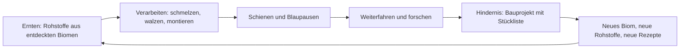
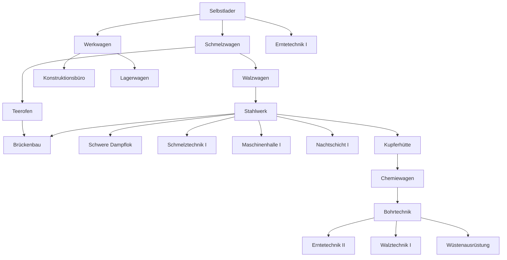

# Loco

**Spielkonzept** · Stand 13. September 2026 · Der erste spielbare Stand ist gebaut, siehe Abschnitt 15

| | |
|---|---|
| Name | Loco |
| Die Linie im Spiel | Linie Null, die erste Bahn in eine unerschlossene Welt |
| Genre | Idle-Aufbauspiel mit Produktionsketten, in der Tradition von Idle Planet Miner und Dyson Sphere Program |
| Plattform | Progressive Web App. Handy im Hochformat zuerst, Desktop-Browser ebenfalls |
| Sprache | Deutsch (Schweiz) |
| Status | Erster spielbarer Stand fertig: drei Biome, zwei Bauprojekte, Konten und Cloud-Spielstände |

## Inhalt

1. [Pitch](#1-pitch)
2. [Herleitung und Entscheidungen](#2-herleitung-und-entscheidungen)
3. [Design-Säulen](#3-design-säulen)
4. [Kern-Loop](#4-kern-loop)
5. [Die Welt](#5-die-welt)
6. [Der Zug](#6-der-zug)
7. [Produktion](#7-produktion)
8. [Forschung](#8-forschung)
9. [Bauprojekte](#9-bauprojekte)
10. [Offline und Rückkehr](#10-offline-und-rückkehr)
11. [Spielverlauf](#11-spielverlauf)
12. [Oberfläche](#12-oberfläche)
13. [Grafik und Ton](#13-grafik-und-ton)
14. [Technik](#14-technik)
15. [Erster spielbarer Stand](#15-erster-spielbarer-stand)
16. [Später](#16-später)
17. [Risiken und offene Fragen](#17-risiken-und-offene-fragen)
18. [Glossar](#18-glossar)

## 1. Pitch

Du bist Ingenieurin oder Ingenieur der Linie Null, der ersten Bahnlinie in eine Welt, die noch niemand durchquert hat. Dein Zug ist deine Fabrik: Jeder Wagen ist eine Maschine, Schienen sind ein Produkt, und ohne Schienen steht der Zug. Vor dir liegen Biome mit neuen Rohstoffen und Hindernisse, die nur ein Bauprojekt überwindet: eine Brücke, ein Tunnel, eine Fähre, am Ende ein Raumbahnhof.

Am Anfang schaufelst du Kohle von Hand. Am Ende plant ein Fahrplan den Zug, und du kommst nach Stunden zurück, um zu sehen, wie weit er gekommen ist.

## 2. Herleitung und Entscheidungen

Im Brainstorming standen fünf Richtungen zur Wahl: der Zug, ein Turm, ein Generationenschiff, Terraforming und ein Uhrwerk-Automat. Der Zug hat gewonnen, weil er alle sechs Säulen trägt, weil Weiterfahren die natürlichste Offline-Metapher ist, und weil eine Linie von Wagen eine Fabrik ist, die eine Person bauen und balancieren kann. Der Turm bleibt als Plan B mit derselben Engine dokumentiert (siehe Abschnitt 16).

Folgende Entscheidungen sind gefallen und gelten für alle weiteren Schritte:

| Nr. | Frage | Entscheidung |
|---|---|---|
| 1 | Thema | Der Zug |
| 2 | Lager | Ein gemeinsames Zuglager. Die Reihenfolge der Wagen zählt nur für Nachbarschaftsboni. Wagen mit eigenen Puffern sind eine spätere Erweiterung |
| 3 | Geld | Kein Geld. Kilometer und Blaupausen sind die Währungen. Frachtaufträge kommen später als Bonusquelle |
| 4 | Zahlenstil | Fabrik-Raten in Stück pro Minute, überschaubar und lesbar. Keine Exponentialzahlen |
| 5 | Handarbeit | Die ersten Minuten arbeitet man von Hand. Danach ist Tippen nie mehr Pflicht, nur noch Beschleunigung |
| 6 | Grafik | Flache Silhouetten als SVG, kräftige Biomfarben, ruhige Animationen |
| 7 | Prestige | «Neue Linie» ist eingeplant, wird aber erst nach dem ersten kompletten Durchlauf gestaltet |
| 8 | Name | Loco. Die Bahnlinie im Spiel heisst weiterhin Linie Null |

## 3. Design-Säulen

Jede Funktion muss mindestens eine Säule stützen. Was keine stützt, fliegt raus.

| Säule | Was das im Spiel heisst |
|---|---|
| Ketten | Produkte bauen Produkte. Jede Stufe hat Rezepte mit mehreren Vorstufen. Eine Kette muss man erst durchschauen und dann beherrschen |
| Aufstieg | Bessere Wagen, bessere Loks, höhere Stufen. Der Ertrag wird reinvestiert: in Tempo (mehr Wagen, höhere Stufe) oder in Effizienz (Technologien) |
| Vom Handwerk zur Automation | Handkurbel und Werkbank am Anfang. Dann Wagen, die von selbst laufen. Dann Kräne, Aussenposten, Fahrplan |
| Meilensteine | Bauprojekte mit Stückliste. Die Brücke ist die erste blaue Matrix: Sie verlangt eine laufende Stahlkette. Wenn sie steht, ändert sich die Welt sichtbar |
| Es läuft weiter | Der Zug fährt und produziert, während die App geschlossen ist, bis zu einem Deckel. Die Rückkehr bekommt einen Bericht |
| Etwas wächst sichtbar | Der Zug wird länger und moderner. Brücken und Tunnel bleiben in der Landschaft stehen. Man sieht den Fortschritt, ohne eine Zahl zu lesen |

## 4. Kern-Loop



Zwei Produkte treiben alles an:

- **Schienen** bringen Kilometer. Ein Kilometer Strecke verbraucht 100 Schienen.
- **Blaupausen** bringen Forschung. Jede Stufe hat ihre eigene Blaupause, gebaut aus zwei Produkten dieser Stufe.

Alles andere existiert, um diese beiden effizienter zu machen. Es gibt kein Geld. Fortschritt misst sich an vier Dingen: Kilometer, erforschte Technologien, fertige Bauprojekte, und der Lok, die den Zug zieht.

Der Loop hat drei Zeitskalen:

| Skala | Dauer | Was passiert |
|---|---|---|
| Minuten | 1 bis 10 min | Rezept wechseln, Wagen anhängen, Wagen aufstufen, Forschung starten |
| Stunden | 1 bis 3 h | Ein Biom durchqueren, ein Bauprojekt füllen, eine Lok bauen |
| Tage | 1 bis 3 Tage | Eine Stufe abschliessen, den ersten spielbaren Stand durchspielen |

## 5. Die Welt

### 5.1 Fiktion

Die Welt ist ein Kontinent, den niemand durchquert hat. Die Gesellschaft Linie Null baut die erste Bahn hinein, und zwar so, wie es die Gründer für richtig halten: Die Fabrik fährt mit. Was hinter dem Zug liegt, bleibt als Linie offen. Nachschubzüge bringen, was dort abgebaut wird, nur langsamer als vor Ort. Der Ton ist warm und trocken, kein Pathos. Texte sind kurz, Ereignisse werden wie Einträge im Fahrtenbuch formuliert: «Km 8. Der Wald beginnt. Harz gefunden.»

### 5.2 Die Strecke

Die Strecke ist der Techbaum, den man sehen kann. Jedes Biom liefert neue Rohstoffe, jedes Hindernis verlangt eine Stufe mehr Automation.

| Ab km | Biom oder Hindernis | Neue Rohstoffe | Bauprojekt | Im ersten Stand |
|---|---|---|---|---|
| 0 | Tal | Eisenerz, Kohle, Holz, Stein | | ja |
| 6 | Wald | Holz (reich), Harz | | ja |
| 18 | Schlucht | | Brücke | ja |
| 18 | Berg | Kupfererz, Kalk, Salpeter | | ja |
| 28 | Bergmassiv | | Tunnel | ja |
| 40 | Wüste | Sand, Öl, Salz | Wüstenstrecke | nein, Ausblick |
| 60 | Küste | Wasser, Muschelkalk | Fähre | nein |
| 80 | Vulkan | Schwefel, Titan, Erdwärme | | nein |
| 100 | Hochgebirge | Quarz, Silber, Eis | Zahnradbahn | nein |
| 125 | Weltende | | Raumbahnhof | nein |

Die Kilometer bis zur Wüste sind im Spieltest gemessen, die danach sind Platzhalter. Sie waren im ersten Entwurf um ein Drittel länger; die reine Fahrzeit frass dann fast drei Stunden, ohne dass etwas passierte.

### 5.3 Rohstoffe und Ernte

- Ein Erntewagen erntet genau einen Rohstoff, wählbar, jederzeit umschaltbar.
- Jeder Rohstoff ist ab dem Moment verfügbar, in dem sein Biom entdeckt wurde, und bleibt es. Das verhindert Sackgassen: Wer im Berg Teer braucht, kann weiterhin Harz ernten.
- **Vor-Ort-Bonus:** Steht der Zug im Heimat-Biom eines Rohstoffs, erntet ein Erntewagen ihn mit Faktor 1,5. Sonst mit Faktor 1.
- Ernteraten auf Stufe 1, ohne Boni:

| Rohstoff | Heimat | Stück pro Minute |
|---|---|---|
| Eisenerz | Tal | 30 |
| Kohle | Tal | 30 |
| Holz | Tal, im Wald reich | 30 |
| Stein | Tal | 30 |
| Harz | Wald | 20 |
| Kupfererz | Berg | 24 |
| Kalk | Berg | 30 |
| Salpeter | Berg | 20 |

Holz gilt als Rohstoff des Tals, der Wald ist sein reiches Vorkommen: Dort gilt der Vor-Ort-Bonus für Holz ebenfalls.

## 6. Der Zug

### 6.1 Die Lok

Die Lok bestimmt drei Dinge: wie viele Wagen sie zieht, wie schnell der Zug höchstens fährt, und womit sie fährt. Jede neue Lok ist ein Bauprojekt (Abschnitt 9) und der sichtbarste Fortschritt im Spiel.

| Lok | Wagen | Maschinen je Wagen | Höchsttempo | Brennstoff | Verbrauch je km | Im ersten Stand |
|---|---|---|---|---|---|---|
| Dampflok | 8 | 10 | 14 km/h | Kohle | 30 | ja, Start |
| Schwere Dampflok | 12 | 12 | 19 km/h | Koks | 25 | ja |
| Diesellok | 18 | 14 | 20 km/h | Diesel | 15 | nein |
| E-Lok | 28 | 16 | 30 km/h | Strom aus Generatorwagen | | nein |
| Maglev | 40 | 20 | 60 km/h | Strom, Supraleiter | | nein |

Die Wagenzahl begrenzt im ersten Stand nichts: Es gibt sieben Wagentypen und die Dampflok zieht acht Wagen. Die Zugkraft wirkt über die Maschinenplätze, und die zählen wirklich.

Brennstoff wird nur beim Fahren verbraucht und automatisch aus dem Lager genommen. Ein stehender Zug kostet nichts.

### 6.2 Bewegung

- Ein Kilometer Strecke verbraucht 100 Schienen.
- Der Zug fährt, solange Schienen und Brennstoff im Lager sind, höchstens mit dem Tempo der Lok. Bei 14 km/h sind das rund 23 Schienen und 7 Kohle pro Minute.
- Der Zug hält vor einem Hindernis, bis das Bauprojekt fertig ist. Er hält auch ohne Schienen oder ohne Brennstoff. Wagen produzieren im Stand weiter.
- Ohne mindestens ein Stück Brennstoff im Lager fährt der Zug nicht an. Der Verbrauch wird über die Strecke aufsummiert und bei jedem vollen Stück abgebucht.
- Beim Erreichen eines Bioms erscheint ein Fahrtenbuch-Eintrag, die neuen Rohstoffe werden freigeschaltet, und die Landschaft wechselt.

### 6.3 Die Wagen und ihre Maschinen

Ein Wagen ist eine Abteilung, keine einzelne Maschine. Von jedem Typ hängt genau einer im Zug, und er belegt einen Platz hinter der Lok. Gebaut wird nicht in die Breite, sondern nach innen: In jeden Wagen passen **10 Maschinen**, jede mit eigenem Auftrag. Ein Schmelzwagen kann also gleichzeitig Koks und Eisenbarren machen, und wer mehr Schienen will, stellt eine zweite Walzstrasse in den Walzwagen.

| Wagentyp | Maschine darin | Aufgabe | Baukosten | Grundpreis einer Maschine | Freischaltung |
|---|---|---|---|---|---|
| Erntewagen | Erntemaschine | Erntet einen Rohstoff | 1 Fahrgestell, 6 Zahnrad, 10 Bretter | 4 Zahnrad, 6 Bretter | Start |
| Schmelzwagen | Schmelzofen | Koks, Barren, Teer, Stahl | 1 Fahrgestell, 20 Stein, 8 Eisenbarren | 12 Stein, 5 Eisenbarren | Technologie Schmelzwagen |
| Walzwagen | Walzstrasse | Schienen, Träger, Draht | 1 Fahrgestell, 12 Eisenbarren, 6 Zahnrad | 8 Eisenbarren, 4 Zahnrad | Technologie Walzwagen |
| Werkwagen | Montagetisch | Bretter, Zahnräder, Nieten, Bauteile | 1 Fahrgestell, 8 Eisenbarren, 12 Bretter | 5 Eisenbarren, 8 Bretter | Technologie Werkwagen |
| Konstruktionsbüro | Zeichentisch | Blaupausen | 1 Fahrgestell, 20 Bretter, 4 Zahnrad | 12 Bretter, 3 Zahnrad | Technologie Konstruktionsbüro |
| Lagerwagen | Regal | Jedes Regal erhöht jede Lagerkapazität um 200 | 1 Fahrgestell, 16 Bretter, 8 Nieten | 10 Bretter, 5 Nieten | Technologie Lagerwagen |
| Chemiewagen | Reaktor | Sprengstoff, Mörtel | 1 Fahrgestell, 10 Stahl, 8 Kupferdraht | 6 Stahl, 5 Kupferdraht | Technologie Chemiewagen |

Regeln:

- **Die erste Maschine ist im Preis dabei.** Ein frisch angekoppelter Wagen kann sofort arbeiten.
- **Jede weitere Maschine kostet mehr.** Die n-te Maschine kostet das n-fache des Grundpreises: Die zweite Erntemaschine kostet 8 Zahnrad und 12 Bretter, die zehnte 40 und 60. Der Ausbau bleibt so über Stunden ein Ziel, statt an einem Nachmittag erledigt zu sein.
- **Plätze.** 10 je Wagen, plus die Zugkraft der Lok (schwere Dampflok: 2) und plus Forschung (Maschinenhalle I: 4). Im ersten Stand sind 16 erreichbar.
- **Stufen.** Jeder Wagen hat Stufe 1 bis 5. Jede Stufe bringt 20 Prozent mehr Tempo **für jede Maschine darin**, Stufe 5 also Faktor 1,8. Das Aufstufen auf Stufe n kostet n-mal die Baukosten ohne Fahrgestell. Je voller der Wagen, desto mehr lohnt die Stufe.
- **Auftragswechsel** ist jederzeit möglich und kostenlos. Der laufende Fortschritt dieser Maschine geht verloren.
- **Pausieren** nimmt einer Maschine den Auftrag, ohne sie auszubauen: Sie steht still, verbraucht nichts, und der bezahlte Platz bleibt. So drosselt man eine Kette, ohne ein Ersatzrezept suchen zu müssen. Ein Tipp auf ein Rezept lässt sie weiterlaufen, ohne neue Kosten.
- **Ausbauen** einer Maschine gibt die Hälfte ihres Preises zurück, fragt aber zurück und steht nur in der aufgeklappten Maschine: Wer bloss drosseln will, soll nicht aus Versehen den Platz noch einmal bezahlen. Die letzte Maschine bleibt im Wagen, sonst stünde eine leere Hülle im Zug.
- **Abkoppeln** gibt die Hälfte von Wagen und allen Maschinen zurück.
- **Umkoppeln** (Reihenfolge ändern) ist möglich, ändert aber nur das Bild: Die Produktion hängt nicht mehr von der Reihenfolge ab.
- **Kurze Wege.** Stellt eine Maschine im selben Wagen eine Zutat für eine andere her, arbeitet die andere 10 Prozent schneller. Wer Koks und Eisenbarren in denselben Schmelzwagen stellt, bekommt den Bonus geschenkt. Das ist der Nachfolger des Nachbarschaftsbonus und belohnt jetzt, wie man einen Wagen belegt, statt wie man den Zug sortiert.
- **Handkurbel.** Sie sitzt am Wagen, nicht an der Maschine: Ein Tipp treibt alle Erntemaschinen darin an.
- **Status.** Jede Maschine ist aktiv, wartet auf eine Zutat, ist blockiert (Lager voll) oder pausiert. Neben dem Status steht immer, wie viel sie gerade pro Minute liefert: null, sobald sie nicht arbeiten kann. Der Wagen fasst zusammen: «5 Maschinen laufen» oder «2 von 5 laufen · 3 pausiert».
- **Knappe Zutaten.** Maschinen werden in Zugreihenfolge bedient, im Wagen von vorne nach hinten. Wer zuerst frei ist, bekommt zuerst. Das ist gewollt, der Engpass ist am Status ablesbar und mit einer Maschine mehr lösbar.
- **Weiche Kapazität.** Eine Maschine startet keinen Zyklus, wenn ihre Ausgabe am Limit ist. Ein laufender Zyklus liefert aber noch ab, darum kann das Lager um eine Rezeptausgabe überlaufen.

### 6.4 Die Werkstatt

Die Werkstatt ist kein Wagen, sondern ein eigener Bildschirm in der Leiste unten. Sie gehört zum Zug, belegt aber keinen Platz und lässt sich nicht abkoppeln. Sie ist das Werkzeug der Handarbeit:

- **Werkbank.** Jedes freigeschaltete Rezept kann hier von Hand gebaut werden, ohne den passenden Wagen. Aufträge werden in eine Warteschlange von höchstens 30 gestellt und mit einfachem Tempo abgearbeitet. Damit baut man den ersten Werkwagen, bevor es einen Werkwagen gibt. Die Warteschlange blockiert nicht: Der erste Auftrag, dessen Zutaten da sind, kommt dran, auch wenn ein früherer noch wartet.
- **Vorstufen kommen automatisch.** Wer Eisenbarren antippt und keinen Koks hat, bekommt zuerst Koks in die Warteschlange und danach die Eisenbarren. Die Kette wird so tief geplant, wie Rezepte und Bestände es hergeben, vorhandene Ware wird angerechnet, und Überschüsse aus einem Lauf zählen für den nächsten Schritt. Was sich nicht herstellen lässt, also Rohstoffe, wird benannt statt eingeplant: «Es fehlt 2 Eisenerz. Das musst du ernten.» Der Knopf zeigt vorher, wie viele Aufträge daraus werden.
- **Handkurbel.** Vor der Technologie Selbstlader erntet ein Erntewagen nur, wenn man kurbelt: Jeder Tipp gibt 5 Sekunden Ernte. Danach läuft er von selbst, und der Tipp bleibt als kleiner Bonus.
- **Kohle schaufeln.** Ein Tipp auf den Tender gibt 1 Kohle. Das ist der allererste Handgriff im Spiel.

Nach den ersten Minuten ist nichts davon Pflicht. Die Werkbank bleibt nützlich, um einen Engpass kurz zu überbrücken.

### 6.5 Das Lager

- Der Zug hat ein gemeinsames Lager. Alle Wagen nehmen daraus und legen dort ab.
- Jede Ware hat eine Kapazität von 200 Stück, plus 200 pro Regal im Lagerwagen. Blaupausen zählen wie Waren.
- Ist die Kapazität einer Ware erreicht, blockiert die Maschine, die sie herstellt. Das ist der Grund, zurückzukommen, und der Grund für Regale.
- Baustellen (Abschnitt 9) ziehen Material aus dem Lager, sobald es da ist. Die Kapazität begrenzt also nie ein Bauprojekt.
- **Saldo je Ware.** Der Lagerbildschirm rechnet für jede Ware zusammen, was der Zug gerade herstellt und verbraucht: alle Maschinen, die laufen können, die Werkbank, und die fahrende Lok mit Schienen und Brennstoff. Nicht mitgezählt wird, was gerade nicht laufen kann: eine Erntemaschine ohne Kurbel, eine Maschine mit vollem Ausgabelager, eine pausierte Maschine. Fehlen einer Maschine nur Zutaten, zählt sie weiter: Dann zeigt genau dieses Minus, dass die Kette mehr verlangt, als sie liefert.

## 7. Produktion

### 7.1 Stufen und Blaupausen

| Stufe | Blaupause | Rezept der Blaupause | Typische Produkte | Wo sie beginnt |
|---|---|---|---|---|
| 1 Eisenzeit | Eiserne Blaupause | 1 Zahnrad, 2 Bretter, 10 s | Eisenbarren, Koks, Bretter, Zahnrad, Nieten, Schienen, Fahrgestell | Tal |
| 2 Stahlzeit | Stahl-Blaupause | 1 Dampfkessel, 2 Teer, 20 s | Stahl, Stahlträger, Dampfkessel, Teer, Bohlen | Tal und Wald |
| 3 Kupferzeit | Kupfer-Blaupause | 1 Kupferspule, 1 Sprengstoff, 30 s | Kupferbarren, Kupferdraht, Kupferspule, Bohrkopf, Sprengstoff, Mörtel, Stützbalken | Berg |
| 4 Chemie | Chemie-Blaupause | später | Glas, Diesel, Plastik, Säure, Gummi | Wüste |
| 5 Elektrik | Elektro-Blaupause | später | Generator, Motor, Kabel, Batterie, Oberleitung | Vulkan |
| 6 Hochtechnologie | Titan-Blaupause | später | Chip, Titanlegierung, Supraleiter, Raketenteil | Hochgebirge |

Stufen 1 bis 3 sind im ersten spielbaren Stand.

### 7.2 Rezepte des ersten Stands

Dauer gilt für Stufe 1 ohne Boni. Rate ist die Ausgabe pro Minute.

**Schmelzwagen**

| Rezept | Eingabe | Ausgabe | Dauer | Rate | Freischaltung |
|---|---|---|---|---|---|
| Koks | 1 Kohle | 1 Koks | 2 s | 30 | Start |
| Eisenbarren | 2 Eisenerz, 1 Koks | 1 Eisenbarren | 4 s | 15 | Start |
| Teer | 2 Harz | 1 Teer | 3 s | 20 | Teerofen |
| Stahl | 2 Eisenbarren, 1 Koks | 1 Stahl | 6 s | 10 | Stahlwerk |
| Kupferbarren | 2 Kupfererz, 1 Koks | 1 Kupferbarren | 4 s | 15 | Kupferhütte |

**Walzwagen**

| Rezept | Eingabe | Ausgabe | Dauer | Rate | Freischaltung |
|---|---|---|---|---|---|
| Schienen | 1 Eisenbarren | 2 Schienen | 6 s | 20 | Start |
| Stahlträger | 2 Stahl, 2 Nieten | 1 Stahlträger | 8 s | 7,5 | Stahlwerk |
| Kupferdraht | 1 Kupferbarren | 3 Kupferdraht | 4 s | 45 | Kupferhütte |

**Werkwagen**

| Rezept | Eingabe | Ausgabe | Dauer | Rate | Freischaltung |
|---|---|---|---|---|---|
| Bretter | 1 Holz | 2 Bretter | 2 s | 60 | Start |
| Zahnrad | 1 Eisenbarren | 1 Zahnrad | 3 s | 20 | Start |
| Nieten | 1 Eisenbarren | 4 Nieten | 3 s | 80 | Start |
| Fahrgestell | 4 Eisenbarren, 2 Zahnrad, 4 Bretter | 1 Fahrgestell | 12 s | 5 | Start |
| Bohlen | 2 Bretter, 1 Teer | 2 Bohlen | 4 s | 30 | Teerofen |
| Dampfkessel | 3 Stahl, 6 Nieten | 1 Dampfkessel | 10 s | 6 | Stahlwerk |
| Kupferspule | 4 Kupferdraht, 1 Zahnrad | 1 Kupferspule | 6 s | 10 | Kupferhütte |
| Bohrkopf | 2 Stahl, 1 Kupferspule | 1 Bohrkopf | 8 s | 7,5 | Bohrtechnik |
| Stützbalken | 2 Bohlen, 2 Nieten | 1 Stützbalken | 4 s | 15 | Bohrtechnik |

**Chemiewagen**

| Rezept | Eingabe | Ausgabe | Dauer | Rate | Freischaltung |
|---|---|---|---|---|---|
| Sprengstoff | 2 Salpeter, 1 Koks | 1 Sprengstoff | 5 s | 12 | Chemiewagen |
| Mörtel | 2 Kalk, 1 Stein | 2 Mörtel | 4 s | 30 | Chemiewagen |

**Konstruktionsbüro**

| Rezept | Eingabe | Ausgabe | Dauer | Rate | Freischaltung |
|---|---|---|---|---|---|
| Eiserne Blaupause | 1 Zahnrad, 2 Bretter | 1 | 10 s | 6 | Start |
| Stahl-Blaupause | 1 Dampfkessel, 2 Teer | 1 | 20 s | 3 | Stahlwerk und Teerofen |
| Kupfer-Blaupause | 1 Kupferspule, 1 Sprengstoff | 1 | 30 s | 2 | Chemiewagen |

Zusammen: 8 Rohstoffe, 19 hergestellte Waren, 3 Blaupausen, 22 Rezepte.

### 7.3 Kettenrechnung

Beispiel: Ein Zug, der die Dampflok mit 20 Schienen pro Minute am Limit fährt.

| Wagen | Maschine | Auftrag | Braucht pro Minute | Liefert pro Minute |
|---|---|---|---|---|
| Erntewagen | 1 | Eisenerz | | 30 Eisenerz |
| Erntewagen | 2 | Kohle | | 30 Kohle |
| Schmelzwagen | 1 | Koks | 30 Kohle | 30 Koks |
| Schmelzwagen | 2 | Eisenbarren | 30 Eisenerz, 15 Koks | 15 Eisenbarren |
| Walzwagen | 1 | Schienen | 10 Eisenbarren | 20 Schienen |
| Werkwagen | 1 | Zahnrad, Bretter im Wechsel | 5 Eisenbarren, Holz | Zahnräder, Bretter |
| Konstruktionsbüro | 1 | Eiserne Blaupause | Zahnrad, Bretter | bis 6 Blaupausen |

Das sind fünf Wagen mit je einer oder zwei Maschinen. Die Kohle ist knapp: Der Schmelzofen für Koks nimmt, was da ist, bis sein Lager voll ist, erst dann bleibt Kohle für den Kessel. Die erste echte Entscheidung ist die nächste Maschine: eine zweite Erntemaschine für Kohle, eine für Holz, oder ein zweiter Schmelzofen. Genau so soll sich der Anfang anfühlen: Alles läuft, aber alles ist knapp.

Alle Zahlen in diesem Konzept sind Startwerte. Sie liegen im Code in einer einzigen Datei (`balance.ts`) und werden im Spieltest angepasst.

## 8. Forschung

Forschung kostet Blaupausen und Zeit. Die Blaupausen werden beim Einreihen bezahlt, dann läuft die Forschung im Konstruktionsbüro. Ohne Büro forscht die Werkstatt, mit halbem Tempo.

Es arbeitet immer nur eine Forschung, aber hinter ihr warten bis zu fünf weitere. Eingereiht wird alles, wofür die Blaupausen da sind; eine Voraussetzung darf selbst noch in der Warteschlange stehen, so plant man eine ganze Kette auf einmal. Biome und Bauprojekte müssen dagegen schon erreicht sein, denn darauf wartet die Forschung nicht. Wird eine Forschung fertig, rückt die nächste sofort nach, auch über Nacht. Wer eine wartende Forschung wieder herausnimmt, bekommt ihre Blaupausen zurück; was hinter ihr steht und auf ihr aufbaut, kommt mit heraus. Die laufende Forschung bleibt stehen, ihr Fortschritt wäre sonst verloren.

| Technologie | Kosten | Dauer | Voraussetzung | Wirkung |
|---|---|---|---|---|
| Selbstlader | 3 Eiserne | 30 s | | Erntewagen arbeiten ohne Handkurbel |
| Schmelzwagen | 4 Eiserne | 45 s | Selbstlader | Schmelzwagen baubar |
| Werkwagen | 4 Eiserne | 45 s | Selbstlader | Werkwagen baubar |
| Walzwagen | 6 Eiserne | 60 s | Schmelzwagen | Walzwagen baubar, Schienen automatisch |
| Konstruktionsbüro | 8 Eiserne | 60 s | Werkwagen | Konstruktionsbüro baubar |
| Lagerwagen | 8 Eiserne | 60 s | Werkwagen | Lagerwagen baubar, jedes Regal darin plus 200 Kapazität |
| Erntetechnik I | 12 Eiserne | 90 s | Selbstlader | Ernte plus 25 Prozent |
| Stahlwerk | 20 Eiserne | 120 s | Walzwagen | Stahl, Stahlträger, Dampfkessel |
| Teerofen | 15 Eiserne | 90 s | Schmelzwagen, Wald entdeckt | Teer, Bohlen |
| Brückenbau | 10 Stahl | 120 s | Stahlwerk, Teerofen | Bauprojekt Brücke |
| Schwere Dampflok | 15 Stahl | 180 s | Stahlwerk | Bauprojekt Schwere Dampflok |
| Schmelztechnik I | 12 Stahl | 120 s | Stahlwerk | Schmelzwagen plus 25 Prozent |
| Maschinenhalle I | 14 Stahl | 150 s | Stahlwerk | Vier Maschinenplätze mehr in jedem Wagen |
| Nachtschicht I | 10 Stahl | 120 s | Stahlwerk | Offline-Deckel 12 Stunden |
| Kupferhütte | 20 Stahl | 180 s | Berg entdeckt | Kupferbarren, Kupferdraht, Kupferspule |
| Chemiewagen | 20 Stahl | 180 s | Kupferhütte | Chemiewagen, Sprengstoff, Mörtel |
| Bohrtechnik | 10 Kupfer | 180 s | Chemiewagen | Bohrkopf, Stützbalken, Bauprojekt Tunnel |
| Erntetechnik II | 15 Kupfer | 180 s | Erntetechnik I, Bohrtechnik | Ernte plus 25 Prozent |
| Walztechnik I | 12 Kupfer | 150 s | Bohrtechnik | Walzwagen plus 25 Prozent |
| Wüstenausrüstung | 30 Kupfer | 300 s | Tunnel fertig | Ende des ersten Stands, Ausblick auf die Wüste |



## 9. Bauprojekte

Ein Bauprojekt ist eine Baustelle mit Stückliste. Sie zieht Material aus dem Lager, sobald es da ist, und zeigt je Position einen Balken. Baustellen lassen sich pausieren, damit Material für anderes frei bleibt. Mehrere Baustellen dürfen gleichzeitig offen sein.

Es gibt zwei Arten: Hindernisse auf der Strecke und Loks.

| Projekt | Ort | Stückliste | Voraussetzung | Ergebnis |
|---|---|---|---|---|
| Brücke über die Schlucht | km 18 | 170 Stahlträger, 420 Bohlen, 600 Nieten, 60 Teer | Brückenbau | Der Berg ist erreichbar. Die Brücke steht sichtbar in der Landschaft |
| Schwere Dampflok | Zug | 6 Dampfkessel, 60 Stahl, 120 Nieten, 40 Zahnrad | Schwere Dampflok | 12 Wagen, 19 km/h, Koks als Brennstoff |
| Tunnel durch das Bergmassiv | km 28 | 220 Sprengstoff, 45 Bohrkopf, 260 Stützbalken, 150 Mörtel | Bohrtechnik | Der Berg hinter dem Massiv ist erreichbar |
| Wüstenstrecke | km 40 | im nächsten Stand | | Ausblick, im ersten Stand nicht baubar |

### Der Meilenstein-Moment

Wenn die letzte Position voll ist, passiert etwas Sichtbares, und zwar in dieser Reihenfolge:

1. Die Baustelle meldet «Fertig», mit kurzem Ton und Vibration.
2. Im Zugstreifen wächst das Bauwerk über zwei bis drei Sekunden in die Landschaft: Die Brücke spannt sich über die Schlucht, der Tunnelmund öffnet sich.
3. Der Zug setzt sich in Bewegung und fährt hindurch. Der Fahrtenbuch-Eintrag erscheint.
4. Das nächste Biom wird sichtbar, seine Rohstoffe erscheinen im Erntemenü, neue Technologien leuchten im Forschungsbaum auf.
5. Das Bauwerk bleibt auf der Streckenkarte stehen, mit Datum und Bauzeit.

Bei einer neuen Lok: Die alte Lok wird ausgekoppelt, die neue rollt von vorn heran, die freien Wagenplätze erscheinen.

## 10. Offline und Rückkehr

- Beim Start wird die verstrichene Zeit seit dem letzten Speichern berechnet. Ab 60 Sekunden Abwesenheit wird nachsimuliert.
- Nachsimuliert wird mit derselben Tick-Funktion wie im Spiel, in Schritten von 1 Sekunde, bis zum Deckel. Der Deckel ist 8 Stunden, mit Nachtschicht I 12 Stunden, mit Nachtschicht II (später) 24 Stunden.
- Zeit über dem Deckel verfällt. Fiktion: «Nachtschicht vorbei, die Mannschaft schläft.»
- Während der Nachsimulation zeigt ein Bildschirm den fahrenden Zug mit laufendem Kilometerzähler. Das Rechnen dauert selbst bei 8 Stunden unter einer Sekunde, der Zähler läuft danach über 1,4 Sekunden auf den neuen Stand, damit die Rückkehr einen Auftritt hat. Wer Bewegung reduziert hat, sieht den Endstand sofort.
- Der **Rückkehr-Bericht** listet: gefahrene Kilometer, erreichte Biome, abgeschlossene Forschung, fertige und fortgeschrittene Bauprojekte, volle Lager, und Warnungen mit Zeitpunkt: «Kohle war nach 3 h 10 min leer. Der Zug stand 4 h 30 min.»
- Die Warnungen sind der Lernmoment des Spiels: Sie zeigen, welcher Engpass die Nacht gekostet hat.

## 11. Spielverlauf

Zielbild für den ersten spielbaren Stand. Aktive Zeit, Wartezeiten kommen dazu.

| Zeit | Phase | Was die Spielerin tut | Was sich öffnet |
|---|---|---|---|
| 0 bis 10 min | Handarbeit | Kohle schaufeln, Erz kurbeln. Werkbank: Koks, Eisenbarren, Zahnrad, Bretter, 3 Eiserne Blaupausen. Selbstlader forschen | Der Erntewagen läuft von selbst |
| 10 bis 30 min | Erste Automation | Schmelz-, Werk- und Walzwagen ankoppeln. Erster automatischer Schienenfluss. Konstruktionsbüro | Der Zug fährt ohne Zutun. Jeder Wagen hat noch neun freie Plätze |
| 30 bis 60 min | Ende des Tals | Lagerwagen, Erntetechnik I, Stahlwerk. Zweite und dritte Maschine in die Engpass-Wagen, Wagen aufstufen | Wald bei km 6. Harz |
| 1 bis 2 h | Wald | Teerofen, Teer und Bohlen bevorraten. Schwere Dampflok bauen. Stahlkette aufbauen | 12 Maschinenplätze je Wagen. Schlucht bei km 18 |
| 2 bis 3 h | Brücke | Baustelle füllen, Engpässe beheben, erste Nacht offline | Erster Meilenstein-Moment. Berg |
| 3 bis 5 h | Berg | Kupferhütte, Chemiewagen, Bohrtechnik, Maschinenhalle I, Tunnel-Baustelle | Zweiter Meilenstein-Moment |
| 5 bis 6 h | Ausklang | Berg bis km 40, Walztechnik, Erntetechnik II | Wüstenstrecke als Ausblick, Ende des Stands |

Die Zahlen sind Zielwerte. Ob sie stimmen, zeigt erst der Spieltest, dafür gibt es die Balancing-Datei und die Simulationstests in Abschnitt 14.

**Messlatte.** Der Autospieler (`src/engine/sim/autoplay.ts`) spielt den ersten Stand mit einer einfachen, dauernd aktiven Strategie und ohne Wartezeiten durch. Er ist die Untergrenze: Ein Mensch, der nicht alle fünf Sekunden umdisponiert, braucht länger.

| Ereignis | Ziel | Erster Entwurf | Nach dem Balancing | Mit Maschinen im Wagen |
|---|---|---|---|---|
| Wald | 30 bis 60 min | 1 h 17 min | 1 h 5 min | 1 h 8 min |
| Schlucht erreicht | 1 bis 2,5 h | 2 h 37 min | 2 h | 1 h 36 min |
| Brücke fertig | 2 bis 3 h | 3 h 26 min | 2 h 51 min | 2 h 4 min |
| Tunnel fertig | 3 bis 5 h | 7 h 25 min | 4 h 41 min | 3 h 26 min |
| Ende des Stands | 5 bis 6 h | über 12 h | 4 h 57 min | 3 h 33 min |

Drei Hebel haben gewirkt, in dieser Reihenfolge: die Strecke um ein Drittel kürzen (die reine Fahrzeit war der grösste Posten), die Loks schneller machen, und die Stücklisten von Brücke und Tunnel um rund ein Viertel senken. Ein vierter Hebel lag beim Autospieler selbst: Er hielt bis zuletzt vier Erntewagen, obwohl alle Rohstofflager voll waren. Mit zwei Erntewagen und mehr Verarbeitung misst er ehrlicher.

Die letzte Spalte ist der Stand, seit ein Wagen mehrere Maschinen fasst. Der Anfang bleibt gleich lang, danach zieht es an: Zehn Maschinen je Wagen liefern mehr als acht Wagen mit je einer, und der Autospieler baut sie voll, sobald er kann. Das Ende des Stands liegt damit rund eineinhalb Stunden unter dem vorherigen Wert und unter dem Zielband. Der Autospieler ist die Untergrenze, ein Mensch braucht länger, aber der Abstand ist gross genug, um im nächsten Spieltest zu prüfen, ob Stücklisten und Forschungsdauern mitwachsen müssen.

Der Autospieler musste dafür umlernen: Er legt Material für das nächste Bauziel zurück, statt es von Maschinen wegfressen zu lassen, er baut die nächste Maschine in den Wagen mit dem grössten offenen Bedarf statt nach fester Quote, und er verteilt die Aufträge, statt zehn Maschinen auf dasselbe leere Lager zu hetzen.

Die Messlatte läuft als Test bei jedem Build mit, `npx vitest run src/engine/autoplay.test.ts` zeigt den Zeitplan.

## 12. Oberfläche

Hochformat zuerst. Alles Wichtige ist mit einem Daumen erreichbar. Kein Bildschirm braucht Erklärtext, jeder Wert zeigt seine Einheit.

### 12.1 Hauptbildschirm

```
+----------------------------------+
|  Zugstreifen, seitlich scrollbar |
|  Himmel, Hügel, Biomfarbe        |
|  [Lok][Ernte][Schmelz][Walz]...  |
|  km 6,4   Wald in 1,6 km   12 km/h|
+----------------------------------+
|  Wagen        5 mit 16 Maschinen |
|  > Erntewagen St2          4/10  |
|    [Erz]x2 108/min [Kohle] 54/min|
|    216/min  4 Maschinen laufen   |
|  > Schmelzwagen St2        5/10  |
|    [Koks]x2 72/min [Barren] 39/min|
|    124/min  wartet auf Koks      |
|  + Wagen anhängen                |
+----------------------------------+
| Zug  Werkstatt  Lager  Forschung  Strecke  Mehr |
+----------------------------------+
```

- Der **Zugstreifen** ist die Bühne: Lok und Wagen in der Landschaft, gezeichnet nach echten Vorbildern, mit Parallax in vier Ebenen. Der Zug fährt nach links, die Räder und das Gestänge der Lok drehen sich mit der gefahrenen Strecke, nur wenn der Zug fährt. Die Bühne steht auf jedem Bildschirm ausser «Mehr» fest oben, nie höher als ein Drittel des Bildschirms, und trägt Kilometerstand, Fahrzustand und das nächste Ereignis; darum gibt es die Statuszeile nur noch unter «Mehr».
- Eine **Kamera** bestimmt den Ausschnitt. Standard je Bildschirm: auf Zug, Werkstatt und Forschung der ganze Zug, im Lager der Lagerwagen, auf der Strecke die Lok. Ein Wagen antippen fährt die Kamera an ihn heran und klappt ihn in der Liste auf, nochmals antippen klappt zu und holt den ganzen Zug zurück; ein Wagen, der in der Liste aufklappt, rückt genauso in die Mitte. Die Lok antippen holt sie gross ins Bild und öffnet die Strecke. Beim Heranfahren wachsen ferne Ebenen weniger als nahe, das gibt Tiefe. Passt ein langer Zug nicht ins Bild, beginnt der Überblick vorne bei der Lok und lässt sich mit dem Finger schwenken.
- Die Bühne bleibt immer sichtbar: Auf dem Zug-Bildschirm legt sich nichts darüber, kein Sheet und kein Dialog.
- Die Bühne ist eine Illustration, keine massstabsgetreue Karte. Die Landschaft zieht mit gefühlter Geschwindigkeit vorbei, nicht mit den echten 14 km/h, sonst stünde das Bild still; eine schnellere Lok fühlt sich schneller an. Ein Hindernis erscheint vor der Lok, sobald der Zug davorsteht, und die Kamera holt beides ins Bild. Ist das Bauwerk fertig, wächst es erst, dann fährt der Zug an und lässt es hinter sich.
- Die **Wagenliste** ist die Arbeitsfläche. Ein Wagen klappt an Ort auf, die anderen rücken nach unten, und ein zweiter Tipp auf die Karte klappt ihn wieder zu. «Wagen anhängen» klappt genauso auf. Sie zeigt Reihenfolge wie im Zug, belegte von freien Maschinenplätzen, was der Wagen ausstösst als Glyphen mit Stückzahl und **Rate je Ware** («Koks ×2, 72/min»), darunter der Status und die Rate des ganzen Wagens. Die Rate je Ware ist die Zahl zum Abstimmen: Liefert der Schmelzwagen 39/min Eisenbarren und frisst der Walzwagen 40/min, sieht man den Engpass, ohne zu rechnen. Umkoppeln geht im Wagen-Detail mit «Nach vorne» und «Nach hinten», Ziehen kommt mit der Bühne in Phase 4.
- Die **Leiste unten** hat sechs Ziele: Zug, Werkstatt, Lager, Forschung, Strecke, Mehr. Ein Punkt an einem Ziel bedeutet: Dort wartet etwas (Forschung fertig, Baustelle fertig, Lager voll).

### 12.2 Weitere Bildschirme

| Bildschirm | Inhalt |
|---|---|
| Wagen-Detail (klappt in der Liste auf) | Liste der Maschinen im Wagen, je Zeile ihr Auftrag als Fluss, ihre Rate pro Minute und ihr Status. Rechts der Pausenknopf, der nur den Auftrag wegnimmt. Antippen klappt die Auftragswahl auf, mit Ausgabe pro Minute je Rezept, und darin steht das Ausbauen mit Rückfrage. Darunter «Maschine bauen» mit Preis, Stufe mit Kosten und Knopf, kurze Wege, Reihenfolge, Abkoppeln |
| Werkstatt (eigener Bildschirm) | Kohle schaufeln und die Werkbank stehen fest oben, nur die Rezepte darunter scrollen. Die Werkbank zeigt den laufenden Auftrag mit Fortschritt, Ausstoss pro Minute und die Warteschlange, gleiche Aufträge zusammengezogen («Koks ×5»). Jedes Rezept in der Liste nennt Dauer und Ausstoss («2 s · 30/min»), damit sich Handarbeit und Wagen vergleichen lassen. Ihr Bereich hat eine feste Höhe, damit die Liste nicht springt, wenn Aufträge dazukommen: Man kann denselben Knopf mehrmals antippen, ohne ihn zu suchen |
| Lager | Alle Waren nach Stufe, Bestand von Kapazität, Nettorate pro Minute mit Vorzeichen. Die Rate ist der Saldo von jetzt, aus allem gerechnet, was gerade läuft, nicht der Durchschnitt der letzten Minute: Wer eine Maschine pausiert, sieht die Zahl sofort umspringen. Volle und leere Waren stehen oben |
| Forschung | Technologien nach Stufe, Kosten in Blaupausen, laufende Forschung mit Balken und darunter die Warteschlange mit Restzeit je Eintrag und Gesamtzeit. Der Knopf heisst «Forschen», solange nichts läuft, danach «Einreihen». Was eingereiht ist, steht in der Liste als «eingereiht» und zählt als Voraussetzung für alles, was danach kommt |
| Strecke | Streckenkarte mit Biomen, Hindernissen, Position. Offene Baustellen mit Stückliste und Balken. Lok mit Upgrade-Projekt. Fahrtenbuch |
| Rückkehr-Bericht (Modal) | Siehe Abschnitt 10 |
| Mehr | Spielstand und Konto, Neustart, Ton, Über das Spiel |

### 12.3 Regeln für Rückmeldung

- Jede Aktion antwortet sofort: Knopf drückt sich, Zahl springt, Wagen erscheint im Streifen.
- Was nicht geht, sagt warum: «Braucht 6 Zahnrad, du hast 2.»
- Zahlen im Format der Schweiz: `1'200`, `7,5/min`.
- Rot ist nur für Blockaden, Messing nur für Fortschritt und Meilensteine.
- Wo produziert wird, steht auch der Ausstoss pro Minute: je Maschine, je Ware im Wagen, je Rezept in der Werkstatt, im Lager als Saldo je Ware. Ohne diese Zahl lässt sich keine Kette abstimmen.
- Jede Rate ist der Stand von jetzt, gerechnet aus dem, was eingestellt ist, und nie ein Durchschnitt über die Vergangenheit. Eine Änderung muss sofort sichtbar sein, sonst traut man der Zahl nicht. Was gerade nicht laufen kann, zeigt null: eine Erntemaschine ohne Kurbel, eine Maschine mit vollem Ausgabelager, eine pausierte Maschine, eine Werkbank ohne Zutaten. Die einzige Ausnahme sind Angebote, also die Rezeptauswahl im Wagen und die Rezeptliste der Werkstatt: Dort steht, was die Maschine leisten würde, denn genau danach wählt man aus.
- Was bezahltes Material vernichtet, fragt zurück und liegt nicht neben einem harmlosen Knopf. Drosseln muss immer einfacher sein als Abreissen.

## 13. Grafik und Ton

- **Stil:** Fahrzeuge als detaillierte SVG-Zeichnungen nach echten Vorbildern, mit Schattierung, Nieten, Fenstern und Lampen, aber ohne Umrisslinien: die Dampflok als Tenderlok mit Gestänge und Rauch, die schwere Dampflok mit vier Treibachsen und Tender, der Erntewagen als offener Wagen mit Haspel und Förderband, der Schmelzwagen als Torpedopfanne mit glühender Öffnung, der Walzwagen als Flachwagen mit Walzgerüst, der Werkwagen als Werkstattwagen mit offener Schiebetür, das Konstruktionsbüro als Personenwagen mit Oberlicht, der Lagerwagen als gedeckter Güterwagen, der Chemiewagen als Kesselwagen. Jeder Wagentyp hat so eine eigene Form und behält seine Farbe, damit man den Zug lesen kann, ohne Text; die Stufe steht als Messingschild am Wagen, eine Lampe zeigt, ob er läuft oder wartet. Landschaft und Bauwerke bleiben flache Flächen in Biomfarben.
- **Biome** haben je eine Farbstimmung für Himmel, ferne Hügel und Boden: Tal grün-grau, Wald dunkelgrün, Schlucht ocker mit Schatten, Berg schiefer-blau, Wüste sandgelb.
- **Bewegung:** Eine Uhr zählt die gefahrene Strecke; daran hängen Räder, Kuppel- und Treibstange, Kreuzkopf und die Parallax-Ebenen (Wolken, ferne Hügel, Vegetation, Boden mit Gleis). Der Zug fährt weich an und bremst weich. Rauch als driftende Kreise, laufende Maschinen zeigen es am Wagen: Glut, Funken, drehende Haspel, Zahnräder, Blasen im Schauglas. Die Kamerafahrt dauert knapp eine Sekunde. Beim Bauwerk eine einzige Einblend-Animation über 2,4 Sekunden, dann zieht es mit dem Boden nach hinten weg. Eine neue Lok rollt von vorne heran. Wer Bewegung reduziert hat, bekommt Standbilder.
- **Vegetation und Felsen** werden deterministisch aus der Kachelnummer gestreut, nie zufällig. So sieht die Landschaft abwechslungsreich aus und flackert beim Neuzeichnen nicht.
- **Icons:** 30 Waren, 30 Glyphen, flach und in einem 24er Raster gezeichnet. Jede hat eine eigene Silhouette: Man soll sie am Umriss unterscheiden, nicht erst an der Farbe. Kohle sind kantige Brocken, Koks gelochte Briketts, Eisenerz ein runder Klumpen mit Adern, Kupfererz einer mit Kristallzacken. Nur wo Waren wirklich verwandt sind, teilen sie eine Grundform und die Stufenfarbe trennt sie: Barren sind Trapeze, Blaupausen beschriebene Blätter. Rohstoffe tragen eigene Farben, weil sie alle auf derselben Stufe liegen. Wagen zeigen überall ihre Silhouette aus der Bühne.
- **Rezepte werden gezeigt, nicht beschrieben.** Überall, wo ein Rezept vorkommt, steht es als Fluss: Zutaten-Icons mit der nötigen Menge als Marke, ein Pfeil, das Ergebnis. Unter jedem Icon steht klein der Name der Ware und darunter der Bestand im Lager, bei Zutaten wie bei Ergebnissen. Fehlt eine Zutat, steht ihr Bestand rot und fett; ist das Lager des Ergebnisses voll, steht dessen Bestand rot. So sieht man auf einen Blick, was ein Wagen braucht, was daraus wird und woran es gerade hakt. Wo es eng ist, nämlich auf der Wagenkarte und in der laufenden Werkbank, bleiben die Namen weg: Dort steht der Rezeptname ohnehin daneben.
- **Ton:** wenig und leise. Im ersten Stand nur ein Akkord beim Meilenstein, erzeugt mit der Web Audio API statt aus einer Datei. Standard aus, in «Mehr» einschaltbar. Dazu eine kurze Vibration, wo das Gerät sie kennt.

## 14. Technik

### 14.1 Stack

| Baustein | Wahl | Grund |
|---|---|---|
| Sprache | TypeScript | Datenmodell mit Typen, Rezeptfehler beim Kompilieren |
| Build | Vite | schnell, PWA-Plugin vorhanden |
| Oberfläche | Svelte 5 | kleine Bundles, feingranulare Reaktivität für viele Live-Zahlen |
| PWA | vite-plugin-pwa mit Workbox | Installation, Offline-Betrieb, Update-Hinweis |
| Speicher | IndexedDB über idb-keyval | ein Spielstand als JSON-Blob, versioniert |
| Tests | Vitest | Engine ohne Browser testbar |
| Hosting | Netlify | statisches Deploy, erreichbar unter loco.alae.app |
| Cloud | Firebase Authentication und Firestore | Konten und Cloud-Spielstände, seit dem Nachbau in `docs/firebase.md` |
| Später | Firebase Cloud Messaging | Push-Nachrichten, noch nicht gebaut |

### 14.2 Architektur

Die Engine ist ein reines Modul ohne Zugriff auf das DOM. Das hatte der frühere Prototyp richtig, das bleibt.

```
src/
  engine/
    data/         Waren, Rezepte, Wagen, Technologien, Biome, Projekte (nur Daten)
    balance.ts    alle Zahlen, die im Spieltest verändert werden
    state.ts      Typen des Spielzustands, Startzustand
    tick.ts       tick(state, dt) in Sekunden, deterministisch
    offline.ts    Nachsimulation und Rückkehr-Bericht
    save.ts       Serialisierung, Versionen, Migrationen
  ui/
    App.svelte, Bildschirme, Komponenten, Zugstreifen
  i18n/
    de-CH.ts      alle Texte
```

Reihenfolge innerhalb eines Ticks, fest und dokumentiert:

1. Ernte
2. Rezepte: Eingabe prüfen, Fortschritt, Ausgabe ins Lager
3. Baustellen ziehen Material
4. Forschung
5. Bewegung: Schienen und Brennstoff abziehen, Kilometer erhöhen
6. Ereignisse: Biom erreicht, Hindernis erreicht, Projekt fertig
7. Warnungen sammeln

Die Engine läuft im ersten Stand im Hauptthread mit festem Zeitschritt von 250 ms. Sie ist Worker-fähig, und wandert in einen Web Worker, sobald die Oberfläche ruckelt. Der Zeitschritt ist ein Parameter, damit die Nachsimulation gröber rechnen darf.

### 14.3 Datenmodell

```ts
type ItemId = string; type RecipeId = string; type TechId = string;

interface Stack { item: ItemId; amount: number }

interface Recipe {
  id: RecipeId; wagon: WagonType;
  inputs: Stack[]; outputs: Stack[]; seconds: number;
  tech?: TechId;
}

interface MachineState {
  id: number;
  recipe?: RecipeId;   // Produktionswagen
  resource?: ItemId;   // Erntewagen
  progress: number;    // Sekunden im Zyklus, bei Ernte Bruchteile
  status: 'aktiv' | 'wartet' | 'blockiert' | 'leer';
}

interface WagonState {
  id: number; type: WagonType; level: 1 | 2 | 3 | 4 | 5;
  machines: MachineState[];   // höchstens so viele wie Plätze
  status: 'aktiv' | 'wartet' | 'blockiert' | 'leer';  // Zusammenfassung
  crankUntil: number;         // die Kurbel gilt für den ganzen Wagen
}

interface GameState {
  version: number; playedSeconds: number; lastSavedAt: number;
  km: number; biome: string; loco: LocoType;
  wagons: WagonState[];
  store: Record<ItemId, number>;
  discovered: ItemId[];
  techs: { done: TechId[]; current?: { id: TechId; progress: number } };
  projects: Record<string, { delivered: Record<ItemId, number>; done: boolean; paused: boolean }>;
  workbench: { queue: RecipeId[]; progress: number };
  log: { km: number; text: string; at: number }[];
}
```

### 14.4 Speichern

- Automatisch alle 10 Sekunden und bei jedem Wechsel in den Hintergrund (`visibilitychange`, `pagehide`).
- Mit Konto zusätzlich alle zwei Minuten und beim Wechsel in den Hintergrund in die Cloud. Verglichen wird beim Anmelden die gespielte Zeit, nicht die Uhrzeit: Ist die Cloud mehr als eine Minute weiter, fragt das Spiel nach und zeigt beide Stände; ist das Gerät weiter, lädt es ungefragt hoch. Ohne Konto läuft alles wie bisher rein lokal.
- Ein Schlüssel `loco/save` in IndexedDB (Stände aus der Zeit als «Linie Null» werden beim Laden übernommen), dazu eine Kopie des letzten funktionierenden Stands als Rückfall.
- `version` im Spielstand, Migrationen als Liste von Funktionen.
- Keine Sicherung als Datei. Der Stand liegt auf dem Gerät und mit Konto in der Cloud; ein zweiter Weg mit eigener Dateiauswahl, eigener Rückfrage und eigener Erinnerung war mehr Oberfläche, als er wert war.

### 14.5 Tests

- **Datenprüfung:** Jede Ware ausser Rohstoffen hat ein Rezept. Jede Rezepteingabe existiert. Jede Technologie verweist auf gültige Rezepte, Wagen und Projekte. Keine Ware ohne Verwendung.
- **Ketten:** Die Kettenrechnung aus Abschnitt 7.3 ergibt 20 Schienen pro Minute im Gleichgewicht.
- **Determinismus:** Zwei Läufe mit gleichem Start und gleichen Eingaben enden im gleichen Zustand.
- **Nachsimulation:** Eine Stunde in Schritten von 250 ms und in Schritten von 1 s weichen um weniger als ein Prozent ab.
- **Projekte:** Eine Baustelle wird fertig, wenn alle Positionen geliefert sind, und zieht nie mehr als nötig.
- **Speichern:** Serialisieren und Laden ergibt den identischen Zustand. Migration von Version 1 auf 2 läuft.
- **Sackgassen:** Ein Skript spielt den ersten Stand mit einer einfachen Strategie durch und muss den Tunnel erreichen.

### 14.6 PWA

- Manifest: Name «Loco», Anzeige `standalone`, Ausrichtung `portrait`, Themenfarbe je Theme, Icons in 192 und 512 Pixel, maskierbar.
- Workbox precached alle Dateien. Bei neuer Version erscheint ein Hinweis «Neue Version bereit, neu laden».
- Wake Lock ist wählbar, damit der Zug beim Zuschauen nicht vom Bildschirmschoner unterbrochen wird.

## 15. Erster spielbarer Stand

### 15.1 Umfang

| Baustein | Enthalten |
|---|---|
| Biome | Tal, Wald, Berg, plus Schlucht und Bergmassiv als Hindernisse |
| Bauprojekte | Brücke, Schwere Dampflok, Tunnel. Wüstenstrecke nur als Ausblick |
| Waren | 8 Rohstoffe, 19 hergestellte Waren, 3 Blaupausen |
| Rezepte | 22 |
| Wagentypen | 7 plus Werkstatt |
| Loks | Dampflok, Schwere Dampflok |
| Technologien | 19 |
| Offline | Deckel 8 h, Nachtschicht I 12 h, Rückkehr-Bericht |
| Speichern | lokal, mit Konto zusätzlich in der Cloud |
| Oberfläche | alle Bildschirme aus Abschnitt 12, Zugstreifen mit einfacher Animation |

Nicht enthalten: Aussenposten, Frachtaufträge, Prestige, Push, Ton (ausser Meilenstein), Wagenpuffer.

### 15.2 Bauplan

| Phase | Ergebnis | Fertig, wenn |
|---|---|---|
| 0 Fundament | Vite, Svelte, TypeScript, Vitest, PWA-Grundgerüst, Netlify-Deploy | Eine leere Seite ist installierbar und läuft offline |
| 1 Engine | Daten, Zustand, Tick, Speichern, alle Tests aus 14.5 | Das Sackgassen-Skript erreicht den Tunnel ohne Oberfläche |
| 2 Bedienung | Wagenliste, Wagen-Detail, Werkstatt, Lager, Forschung, Strecke mit Baustellen | Der erste Stand ist mit Buchstabenmarken statt Icons durchspielbar |
| 3 Rückkehr | Nachsimulation, Rückkehr-Bericht, Warnungen | Eine Nacht offline liefert einen korrekten Bericht |
| 4 Bühne | Zugstreifen mit Biomen, Parallax, Bauwerke, Meilenstein-Moment, Lokwechsel | Die Brücke wächst sichtbar, der Zug fährt drüber |
| 5 Spieltest | Balancing, Icons, Texte, Ton beim Meilenstein | Zwei Testpersonen erreichen den Tunnel an einem Abend plus einer Nacht |

Jede Phase ist ein eigener Pull Request. Phase 0 berührt Deploy-Konfiguration und wird deshalb nicht ohne Rückfrage gemerged.

### 15.3 Erfolgskriterien

- Nach 10 Minuten läuft die erste Automation, ohne dass ein Text erklärt hat, was zu tun ist.
- Die Brücke fühlt sich wie ein Ereignis an: Testpersonen erwähnen sie ungefragt.
- Nach einer Nacht offline weiss die Spielerin aus dem Bericht, welcher Engpass sie gebremst hat.
- Kein Zustand, aus dem man nicht weiterkommt.
- Die Seite lädt auf einem Mittelklasse-Handy in unter zwei Sekunden und ruckelt nicht.

## 16. Später

In dieser Reihenfolge, jede Stufe erst, wenn die vorherige im Spieltest trägt.

1. **Wüste und Küste:** Diesellok, Chemie-Stufe, Wüstenstrecke und Fähre als Bauprojekte.
2. **Nachtschicht II** und Forschungs-Warteschlange.
3. **Frachtaufträge:** Bahnhöfe entlang der Strecke, die Ware gegen Blaupausen oder Boni annehmen. Kein Geld.
4. **Aussenposten:** Ein Bergwerk bleibt zurück, ein Güterzug pendelt. Das Gegenstück zu den Logistikstationen in Dyson Sphere Program, in einer Dimension.
5. **Fahrplan:** Autopilot, der Rezepte nach Bedarf wechselt und Wagengruppen als Vorlage kopiert.
6. **Vulkan, Hochgebirge, Weltende:** Elektrik, Hochtechnologie, E-Lok, Maglev, Raumbahnhof.
7. **Prestige «Neue Linie»:** ein neuer Kontinent mit anderer Biomfolge, Startboni durch erfahrene Ingenieure.
8. **Push** über Firebase Cloud Messaging, wenn es Spielerinnen ausserhalb des eigenen Handys gibt. Konten und Cloud-Spielstände sind gebaut, siehe `docs/firebase.md`.

**Plan B, der Turm.** Sollte sich das Hochformat als wichtiger erweisen als die Schiene, bleibt die Engine gleich: Wagen werden Stockwerke, Kilometer werden Höhenmeter, Schienen werden Träger, Zugkraft wird Statik, Biome werden Höhenschichten, Brücke und Tunnel werden Wolkendecke und Jetstream. Nur der Zugstreifen und die Fiktion ändern sich.

## 17. Risiken und offene Fragen

| Risiko | Umgang |
|---|---|
| Das Tempo stimmt nicht | In Phase 5 gemessen und korrigiert, siehe Messlatte in Abschnitt 11. Alle Zahlen in `balance.ts` und `data/`, der Autospieler misst bei jedem Build nach |
| 8 Wagenplätze fühlen sich eng statt spannend an | Wert ist ein Parameter. Alternative: Werkstatt kann ein zweites Rezept fahren |
| Die Werkbank macht Wagen überflüssig | Warteschlange 10, einfaches Tempo, kein Nachbarschaftsbonus, keine Stufen |
| Baustellen saugen das Lager leer und stoppen den Wagenbau | Pausieren pro Baustelle. Falls das nicht reicht: Reserve pro Ware einstellbar |
| Safari löscht Daten nach sieben Tagen | Rückfallkopie, und mit Konto der Spielstand in der Cloud. Wer ohne Konto spielt, verliert den Stand: Das ist der Preis dafür, dass es keine Sicherung als Datei mehr gibt |
| Der Zugstreifen kostet mehr Zeit als die ganze Engine | Phase 4 kommt nach der spielbaren Version. Der Stand ist auch mit Buchstabenmarken und stehendem Zug spielbar |
| Der Vor-Ort-Bonus wird nicht bemerkt | Im Erntemenü als «vor Ort, mal 1,5» beschriften. Falls wirkungslos: streichen |

Offen, mit Entscheidung im Spieltest:

- Sollen Wagen Gewicht haben, so dass ein Lagerwagen zwei Plätze belegt?
- Soll die Lok im Stand Brennstoff verbrauchen («Kessel warm halten»), um Stillstand teuer zu machen?
- Braucht der erste Stand Ton, oder reicht Vibration beim Meilenstein?

## 18. Glossar

| Begriff | Bedeutung |
|---|---|
| Lok | Zieht den Zug. Bestimmt Wagenzahl, Tempo, Brennstoff |
| Wagen | Eine Abteilung im Zug mit Stufe. Von jedem Typ genau einer |
| Maschine | Der Arbeitsplatz im Wagen mit einem eigenen Auftrag. 10 passen hinein, mehr mit Lok und Forschung |
| Werkstatt | Fester Wagen hinter der Lok für Handarbeit: Werkbank, Handkurbel, Kohle schaufeln |
| Lager | Gemeinsamer Vorrat des Zugs, mit Kapazität je Ware |
| Blaupause | Forschungswährung. Eine je Stufe |
| Bauprojekt | Baustelle mit Stückliste. Hindernis auf der Strecke oder neue Lok |
| Biom | Streckenabschnitt mit eigenen Rohstoffen |
| Hindernis | Stelle auf der Strecke, die ein Bauprojekt verlangt |
| Vor-Ort-Bonus | Ernte mal 1,5 im Heimat-Biom des Rohstoffs |
| Kurze Wege | 10 Prozent Tempo, wenn eine Maschine im selben Wagen die Zutat liefert |
| Nachtschicht | Offline-Deckel und die Technologien, die ihn verlängern |
| Fahrtenbuch | Ereignisliste mit Kilometerstand |
| Rückkehr-Bericht | Zusammenfassung der Offline-Zeit beim Öffnen |
